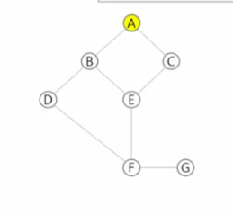

# 2023_08_10

## DP Dynamic Programming

동적 계획 알고리즘은 그리디 알고리즘과 같이 **최적화 문제**를 해결하는 알고리즘

동적 계획 알고리즘은 먼저 입력 크기가 작은 부분 문제들을 모두 해결한 후에 그 해들을 이용, 보다 큰 크기의 부분 문제들을 해결하여 최종적으로 원래 주어진 입력의 문제를 해결하는 알고리즘 

피보나치 수는 부분 문제의 답으로부터 본 문제의 답을 얻을 수 있으므로, 최적부분구조로 이루어져 있다.

```py
def fibo(n):
    global cnt 
    cnt += 1
    dp = [0] * (n+1)
    dp[0] = 0
    dp[1] = 1
    for i in range(2, n+1):
        dp[i] = dp[i-1] + dp[i-2]
    return dp[n]
cnt = 0
print(fibo(100), cnt)

dp = [0] * (100+1)
dp[0] = 0
dp[1] = 1
for i in range(2, 101):
    dp[i] = dp[i-1] + dp[i-2]
# 대충 몇번하건간에 여기서 쓱 싹 하면 테이블 내부에서 한번에 돌아감
# 걍 불러오기가 됨
# 트리 or dp (암튼 선형시간에 해결)

```
### DP의 구현 방식

- recursive 방식 
- iterative 방식

::: memoization을 재귀적 구조에 사용하는 것 보다 반복적 구조로 DP를 구현한 것이 성능면에서 보다 효율적이다 (?)(무슨뜻이지)

재귀적 구조는 오버헤드 발생시킴:
- 오버헤드는 어떤 처리를 하기 위해 들어가는 간접적인 처리 시간 · 메모리 등을 말한다

## DFS 깊이 우선 탐색
비선형구조인 그래프 구조는 그래프로 표현된 모든 자료를 빠짐없이 검색하는 것이 중요하다.

-깊이 우선 탐색 Depth First Search DFS
-너비 우선 탐색 Breadth First Search BFS

시작 정점의 한 방향으로 갈 수 있는 경로가 있는 곳까지 깊이 탐색해 가다가 더 이상 갈 수 없다면, 가장 마지막에 만났던 갈림길 간선이 있는 정점으로 되돌아 와서 다른 방향의 정점으로 탐색을 계속 반복하여 결국 모든 정점을 방문하는 순회방법

가장 마지막에 만났던 갈림길의 정점으로 되돌아가서 다시 깊이 우선 탐색을 반복해야 하므로 후입선출 구조의 스택 사용 

### DFS 알고리즘 
1. 시작 정점 v 를 결정, 방문
2. 정점 v에 인접한 정점 중, 
   1.  방문하지 않은 정점 w가 있다면 정점 v를 스택에 push하고 정점 w를 방문한다. 그리고 w를 v로 하여 다시 2.를 반복한다.
   2.  방문하지 않은 정점이 없으면, 탐색의 방향을 바꾸기 위해서 스택을 pop하여 받은 가장 마지막 방문 정점을 v로하여 다시 2를 반복한다.
3.  스택이 공백이 될 때까지 반복.

```py
visited[], stack[] # 초기화
DFS(v)
    #공사 실패!
    시작점 v 방문...
    visited[v] 악
```

#### DFS 예


1) 정점 A를 시작으로 깊이 우선 탐색
    ```py
    #A 방문:
    visited[A] = True
    ```
2) 정점 A에 방문하지 않은 B,C 있으므로 A를 스택에 push, 인접정점 B와 C 중에 오름차순에 따라 B 를 선택, 탐색 진행
3) b에 D, E 있음 -- > B push, 인접정점 D 선택, 탐색
4) D에 미방문 정점 F 있음 --> D push, F 선택, 탐색
5) F에 미방문 E G 있음 --> F push, E 선택, 탐색
6) C에 미방문 없음. 스택에서 pop, E로 이동 (뒷걸음...) E에 미방문 있는지 확인
7) E에 미방문 없음 스택에서 pop F로 이동
8) F에 미방문 G  --> F push, G로 이동

#### ejemplo 2

```py
def dfs(s):
    ST = []
    visited = [False] *(N+1)
    ST.append(s)
    while ST:
        v = ST.pop()
        if not visited[v]:
            print(v)
            visited[v] = True
        for w in G[v]:
            if not visited[w]:
                ST.append(w)

def dfs1(s):
    # 지난 길을 넣거나
    # 갈림길을 넣거나.
    ST = [] # 스택 준비하기
    visited = [False] * (N+1)
    ST.append(s)
    visited[s] = True
    while ST:
        v = ST.pop()
        # if not visited[v]:
        print(v)
            # visited[v] = True
        for w in G[v]: # [2, 3] 들어오는데 2 3 한번씩
            if not visited[w]:
                ST.append(w)
                visited[w] = True
        # for d in range(4):"
        newX, newY = ...

N = 7
S = '1,2,1,3,2,4,2,5,4,6,5,6,6,7,3,7'
lst = list(map(int, S.split(',')))
#print(lst)
G = [[] for _ in range(N+1)]
for idx in range(0,len(lst), 2):
    v1 = lst[idx]
    v2 = lst[idx+1]
    G[v1].append(v2)
    G[v2].append(v1)

print(G)

dfs(1) # 1에서 dfs 시작
'''
G = [
    [],
    [2,3], # 1
    [1, 4, 5], # 2
    [1, 7], # 3
    [2, 6],
    [2, 6],
    [4, 5, 7],
    [3, 6]
]
'''

```

#### 인접행렬?