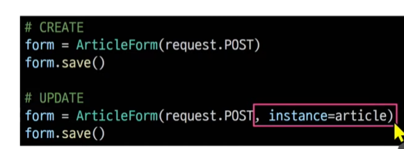

# 2023_09_26

유효성 검사 구현 - 장고는 신이야! 

## Django Form 
사용자 입력 데이터를 수집하고 처리 및 유효성 검사를 수행하기 위한 도구
유효성 검사를 단순화하고 자동화 할 수 있는 기능을 제공

## Form class 정의 

> 앱//forms. py
```py
 class ArticleForm(forms.Form):
    title = forms.CharField(max_length=10)
    content = forms.CharField()

```

유효성 검사는 Django가 해주니까 뭘 받을 것인지만 생각하라.


### form 만들기
- 사용자로부터 입력을 받는 form 을 만드는 필드입니다.
1. forms.py 만들기 ( 앱 내 경로. 대충 잘 불러오면 됨 나중에.)
2. 클래스 만들어주기

```py 
class ArticleForm(forms.Form):
  title = forms.CharField(max_length=10)
  content = forms.CharField()
  # 폼 필드에서는 max_length가 필수 인자가 아니다.
```
모델 != form


{{form.as_p}}   각각<p>로 덮어줍니다.

### widgets
HTML 'input' element의 표현을 담당.
정해진 built-in widget이 있다.

### 테이블 vs 인풋
(model vs form)
form : 저장을 목적으로(?)
modelform이라는 이상한 놈이 있음 
model 기반이기 때문에 재정의 필요성 X  
### Form
사용자 입력 데이터를 DB에 저장하지 않을 때 
(ej. 로그인 )
### ModelFrom
사용자 입력 데이터를 DB에 저장해야 할 때
ej. 게시글, 회원가입. 

#### 공통점
둘다 사용자로 부터 입력을 받음
#### 차이점 
db 저장여부 
form은 로그인이나 그런곳에 따로 쓰일 예정
### ModelForm 
Model과 연결된 . . . 

#### 자동유효성 검사도 진행해줍니다.
>> create 로직 변경.

#### 금일 view 함수의 대격변이 계속해서 될 것입니다.


### is_valid()
여러 유효성 검사를 실행하고, 데이터가 유효한지 여부를 Boolean으로 반환.
-> 공백 X, Max_length

#### modelform을 이용한 edit 수정
#### update는 create를 참조
받고
쓰고
유효성 하고
  유효하면 
  저장 // save가 수정인가, 생성인가 알아야 한다.
  이는 edit처럼 articleform에 instance 를 넣어서 해결한다.
디테일로 리다이렉트
  유효하지 못하면
  아무튼 에러페이지
### save()
키워드인자 instance 여부를 통해 생성할 지 수정할 지 결정


## 정리
데이터 수집처리위한 강력하고 유연한 도구
HTML form의 생성, 데이터 유효성 검사 및 처리를 쉽게 할 수 있도록 도움

## widget 응용

## handling HTTP requests
-> view 함수 구조 변화
new v. create 
공통점 : 목적 -> 게시글 생성
그렇다면 분기로 나눠서 
하나의 함수로 합쳐버리자!
차이점 :  new 는 get method
create 는 post method 


-> request method에 따른 요청의 변화
Get  articles/create/ 생생 문서 줘

post articles/create 생성해줘!

