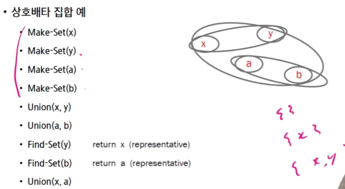
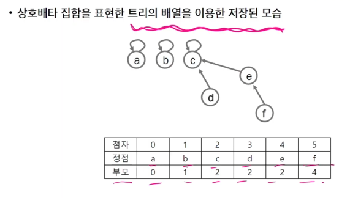
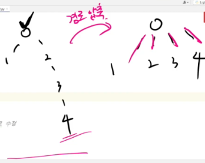
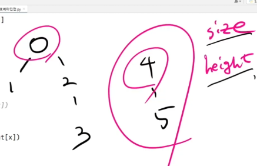

# 2023_09_20

# 그래프

- 그래프 기본
- 그래프 탐색
- 서로소 집합들

## 그래프의 정의
- 연결 관계를 갖는 비선형 자료구조.


### 인접 리스트
- 인접 행렬
  - 장점 : 구현이 쉬움
  - 단점 : 메모리 낭비
    -  0도 표시를 하기 때문
    -  
```py
# 인접 행렬
# 장점 : 구현이 쉬움
# 단점 : 메모리 낭비
#       0도 표시하기 때문.
arr = [
    [0, 1, 0, 1, 0],
    [1, 0, 1, 1, 1],
    [0, 1, 0, 0, 0],
    [0, 1, 0, 1, 0]
]
if arr[0][1] == 1:
    # 갈 수 있음
    pass

```

### 그래프의 유형

#### 그래프 탐색
#### [DFS 인접 행렬 구현](dfs_인접행렬.py)
#### [BFS 인접 행렬 구현](./bfs_인접행렬.py)

### 그래프 탐색 - 인접 리스트
- 인접리스트
  - 갈 수 있는 지점만 저장하자!
  - 주의사항 : 
    - 각 노드마다 갈 수 있는 지점의 수가 다르다.
    - range의 index 조심
  - 메모리가 인접 행렬에 비해 효율적.
```py
graph = [
    [1, 3],
    [0, 2, 3, 4],
    [1],
    [0, 1, 4],
    [1, 3]
]
# 파이썬은 딕셔너리로도 구현할 수 있다.
graph_dict = {
    "0" : [1, 3],
    "1" : [0, 2, 3, 4],
    "2" : [1],
    "3" : [0, 1, 4],
    "4" : [1, 3]
}
```


#### [DFS 인접리스트](./dfs_인접리스트.py)  - 수정해야함 git 받기
#### [BFS 인접리스트]() - 추가해야함 git 받기 


### 서로소 집합(Disjoint-sets)
- 서로소 또는 상호배타 집합들은 서로 중복 포함된 원소가 없는 집합들이다. 다시 말해 교집합이 없다.
- 집합에 속한 하나의 특정 멤버를 통해 각 집합들을 구분한다. 이를 대표자라고 한다.(representative)
- " 나는 AA에 속해있다!! "
  
- 표현 방법
  - 상호배타 집합을 표현하는 방법
    - 연결 리스트
    - 트리
  - 상호배타 집합 연산
    - Make-Set(x)
    - Find-Set(x) 
    - Union(x, y)
  
- 핵심 개념
  1. 대표자 저장 (같은 그룹으로 묶기)
  2. 각 요소가 내가 속한 그룹의 대표자를 어떻게 찾을 수 있는지
<br>



#### 상호 배타 집합 표현의 표현방법

- 연결리스트

- 트리
  - 하나의 집합을 하나의 트리로 표현한다
  - 자식 노드가 부모 노드를 가리키며 루트 노드가 대표자가 된다.
 <br>


  -  대표의 대표의 대표의 대표의 대표의 대표의 대표의 대표의 대표의 대표의 대표를 찾아 진짜 대표 찾음
  -  이미지의 부모는 실제로 부모임
  -  나중에 데이터를 이용할 때 대표를 쓰는 것


  - 효율용 경로 압축


  - 합칠 때 . . . (찾아보세요) (height = rank)