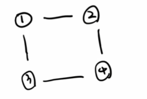
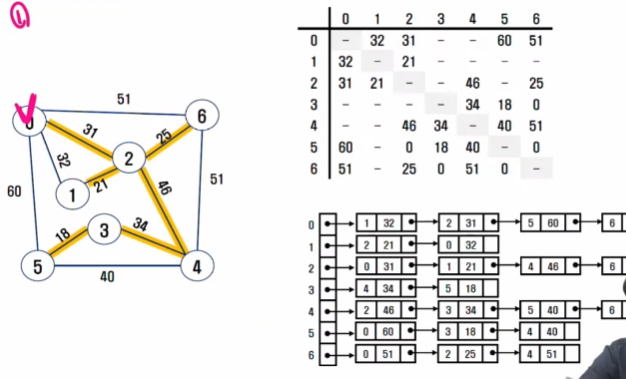
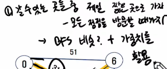
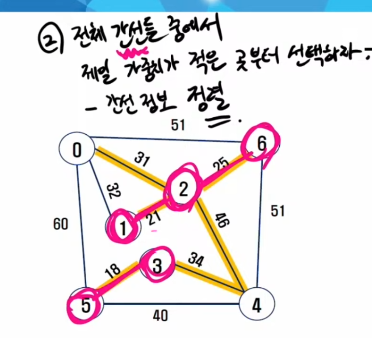
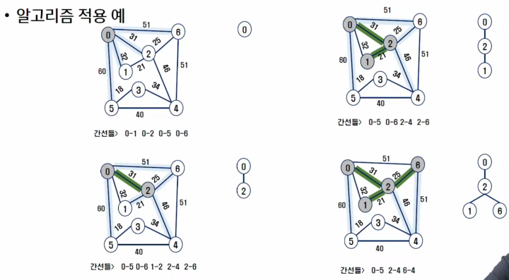
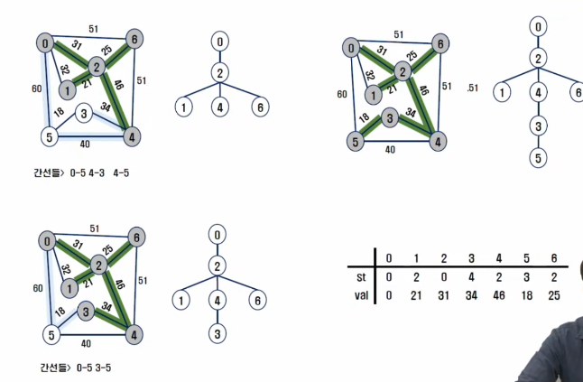
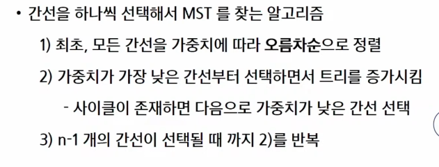
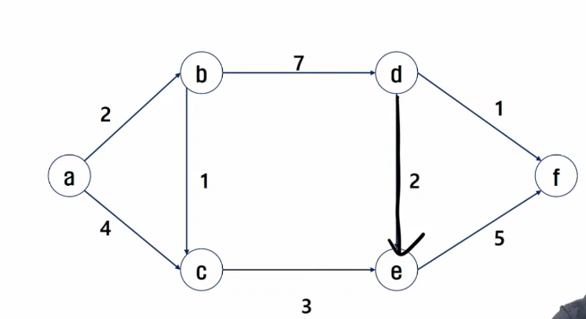
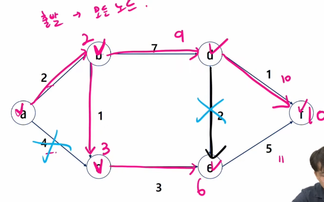

# 2023_09_21

## 최소 비용 신장 트리 (MST)

- 그래프에서 최소 비용 문제 
  - 1) 모든 정점을 연결하는 간선들의 가중치의 합이 최소가 되는 트리 (MST)
  - 2) 두 정점 사이의 최소 비용의 경로 찾기 (다익스트라)
  
-  신장 트리
   -  n개의 정점으로 이루어진 무방향 그래프에서 n개의 정점과 n-1개의 간선으로 이루어진 트리
  
### 신장트리란?
1. 모든 정점을 연결
2. 사이클이 존재하지 않는 부분 그래프
   - 간선의 개수 : N - 1 개
3. 한 그래프에서 여러 개의 신장 트리가 나올 수 있다
  
  이 이미지에서 4개가 나온다.

 - 최소 신장 트리(Minimum Spanning Tree)
   - 무방향 가중치 그래프에서 신장트리를 구성하는 간선들의 가중치의 합이 최소인 신장트리

ej.) 우리는 도로 건설 계획을 세우고 있다. 총 N 개의 도시를 연결하는 도로를 건설하려고 할 때 모든 도시에 갈 수 있도록 하며, 가장 비용이 적게 들도록 도로를 건설하는 경우의 수를 구하시오.

  
완전탐색하면 난리나겠죠?
  

1-> 특정 **정점**에서 출발, 내가 갈 수 있는 것 중에서 제일 짧은 곳으로 가자! - 모든 정점을 방문할 때 까지.

 

2-> 전체 **간선**들 중에서 제일 가중치가 적은 곳 부터 선택하자.
  

### Prim 알고리즘
- 하나의 정점에서 연결된 간선들 중에 하나씩 선택하면서 MST를 만들어 가는 방식
- 1. 임의 정점을 하나 선택해서 시작
- 2. 선택한 정점과 인접하는 정점들 중 최소 비용의 간선이 존재하는 정점을 선택
- 3. 모든 정점이 선택될 때 까지 1,2 반복

- 서로소인 2개의 집합 (2 disjoint-sets) 정보를 유지
  - 트리 정점들(tree vertices) - MST를 만들기 위해 선택된 정점들
  - 비트리 정점들(nontree vertices) - 선택되지 않은 정점들

적용 예  

어... 어... 어...
[prim 구현](./prim_mine.py)

###  KRUSKAL 알고리즘

 

1. 전체 간선을 보고 제일 작은 것 순서로 => 기존 방문(체크) (그리디)
[Kruskal 구현](./Kruskal_mine.py)

## 최단경로
-간선의 가중치가 있는 그래프에서 두 정점 사이의 경로들 중에 간선의 가중치의 합이 최소인 경로

- 하나의 시작 정점에서 끝 정점까지의 최단경로
  - 다익스트라(dijkstra) 알고리즘
    - 음의 가중치를 허용하지 않음
  - 벨만-포드(Bellman-Ford)알고리즘
    - 음의 가중치를 허용
  - 모든 정점들에 대한 최단 경로
   - 플로이드 워샬(Floyd-Warshall)

### Dijkstra 알고리즘
- 시작 정점에서 거리가 최소인 정점을 선택해 나가면서 최단 경로를 구하는 방식이다.
  - 누적거리  

- 시작정점 (S)에서 끝 정점 (T)까지의 최단 경로에 정점 x가 존재한다.
- 이때, 최단 경로는 s에서 x까지의 최단 경로와 x에서 t까지의 최단경로 구성된다.
- 탐욕 기법을 사용한 알고리즘으로 MST의 프림 알고리즘과 유사하다.

 

 
돌리면 이런 모양.

[Dijkstra 구현](./Dijkstra_mine.py)