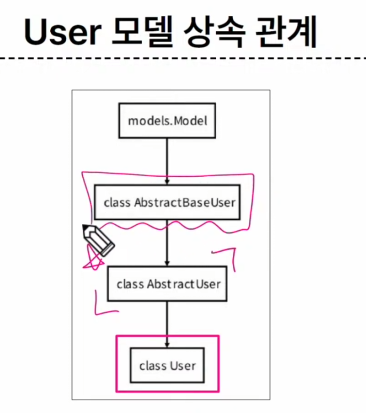

# 23_10_04

## HTTP 
HTML 문서와 같은 리소스를 가져올 수 있도록 해주는 규약, www(웹)에서 이루어지는 모든 데이터 교환의 기초
1. 비 연결 지향
   - 서버는 요청에 대한 응답을 보낸 후 연결을 끊음
2. 무상태
   - 연결을 끊는 순간 클라이언트와 서버 간의 통신이 끝나며 상태 정보가 유지되지 않음
   - Ex) 장바구니에 담은 상품을 유지할 수 없다. 로그인 상태를 유지할 수 없다

## 쿠키(cookie)
서버가 사용자의 웹 브라우저에 전송하는 작은 데이터 조각
- 클라이언트 측에서 저장되는 작은 데이터 파일이며, 사용자 인증, 추적, 상태 유지 등에 사용되는 데이터 저장 방식

### 사용 예시
1. The browser requests a web page.
2. The server sends the page and the cookie
3. The browser requests another page from the **same server**.

### 사용 원리
브라우저는 쿠키를 KEY-VALUE의 데이터 형식으로 저장 
이렇게 쿠키를 저장해 놓았다가, 동일한 서버에 재요청 시 저장된 쿠키를 함께 전송
> 쿠키는 두 요청이 동일한 브라우저에서 들어왔는지 아닌지를 판단할 때 주로 사용
> 이를 이용, 사용자의 로그인 상태 유지 가능
> 상태가  없는 HTTP 프로토콜에서 상태 유지를 가능하게 한다.
<p>
계속 쿠키를 계속 전송함 = 상태 유지

### 사용 목적
1. 세션 관리(Session management)
   - 로그인, 아이디 자동완성, 공지 하루 안 보기, 팝업 체크, 장바구니 등의 정보 관리
2. 개인화 (Personalization)
   - 사용자 선호, 테마 등의 설정
3. 트래킹 (Tracking)
   - 사용자 행동을 기록 및 분석

## 세션(Session) 
서버 측에서 생성되어 클라이언트와 서버간의 상태를 유지 <br>
상태정보를 저장하는 데이터 저장 방식
> 쿠키에 세션 데이터를 저장하여 매 요청시마다 세션 데이터를 함께 보냄

### 세션 작동 원리
1. 로그인을 하면 서버가 session 데이터를 생성 후 저장
2. 생성된 session 데이터에 인증 할 수 있는 session id 발급
3. 발급한 session id를 클라이언트에게 응답
4. 클라이언트는 응답 받은 session id를 쿠키에 저장
5. 동일한 서버에 다시 접속하면 요청과 함께 쿠키(session id가 저장된)를 전달
6. 쿠키는 요청시마다 서버에 함께 전송되므로,  session id를 확인해 로그인 되어있다는 것을 알도록 함

### 쿠키 : 세션 목적
서버와 클라이언트 간의 상태 유지 (매 요청마다 쿠키를 보내서 로그인(예시)되어있다는 사실을 입증하는 데이터를 보내는것임.)


### 쿠키 수명
1. Session cookie 
   - 현재 세션이 종료되면 삭제
   - 브라우저 종료와 함께 삭제
2. Persistent cookies
   - 지정 날짜, 지정 기간

## Django Authentiction System
장고 인증 시스템

### 사전준비 : 두 번째 app인 accounts 생성 & 등록
- auth 와 관련 경로나, 키워드를 django 내부적으로 accounts 라고 사용하기에, 되도록 'accounts'로 지정하는 것을 *권장*


---
```py
# accounts에도 url 만들기  
# acc.app urls.py
app_name = 'accounts'  

# pjt, setting.py
 path('accounts', include('accounts.ulrs'))


```
accounts에도 url 만들기  
app_name = 'accounts'  

pjt, setting.py path('accounts', include('accounts.ulrs'))

## Custom User model
django.contrib.auth 가 유저 만들 수 있게 세팅.  


### User 클래스를 대체하는 이유
- 내장된 user 클래스를 사용했음
- 별도의 설정 없이 사용 가능해 편하나,
- 개발자가 *직접 수정할 수 없다*는 문제

```py 
# account models.py

from django.contrib.auth.models import AbstractUser

class User(AbstractUser):
  # 기본 유저모델임을 알려줘야 한다.
  pass

  # 필요할 때 바꾸면 됨
  # 대체만 해 둔 것


# pjt. setting.py
AUTH_USER_MODEL = 'account.User'

# admin.py

from django.contrib.auth.admin import UserAdmin
from .models import User

admin.site.register(User, UserAdmin)
```
중간에 못바꾸니, 바꿔야하면 암튼 db 초기화하셈

## 프로젝트를 시작하며 반드시 user모델을 대체해야 한다
 - django는 새 프로젝트를 시작하는 경우 비록 기본 user모델이 충분하더라도 커스텀 user모델을 설정하는 것을 강력하게 권장하고있다.   
-  커스텀 user모델은 기본user모델과 동일하게 작동하면서도 필요한 경우 나중에 맞춤 설정할 수 있기 때문  
-  단 user모델 대체 작업은 프로젝트의 모든 migrations 혹은 첫migrate를 실행하기 전에 이 작업을 마쳐야 한다.  

## Login / Logout
- session을 create 하는 과정

## AuthenticationForm()
로그인 인증에 사용할 데이터를 입력받는 built-in form

전부  built-in form 쓸 것입니다 .


저장여부의 차이 
- form : ( 저장 안해서 / 로그인)
- modelform :  ( 회원가입 )
  
```py
# accounts 

# urls.py
  path('login/', views.login, name='login'),

#  views.py
# import 해오세요 
# redirect import
from django.contrib.auth.forms import AuthenticationForm
from django.contrib.auth import login as auth_login
from django.contrib.auth import logout as auth_logout

def login(request):
  if request.method == "POST":
    # 기본적으로 username & password
    form = AuthenticationForm(request, request.POST)
    # form class 는 request가 첫 인자
    # 두번째가 data
    if form is_valid():
      # 내장함수 , 이름은 login  이지만 as 로 auth_login으로 받음
      auth_login(request, form.get_user())
      return redirect('articles:index')
      
  else:
    # get 은 로그인 페이지 줘 응애
    # 아래 함수 내장함수. import
    form = AuthenticationForm()
  context ={
    'form' : form,
  }
  return render(request, 'accounts/login.html', context)

# templates / accounts
```

```html
form action=" method="POST"

{{form.as_p}}

```

슈퍼유저 한번 만들기.
pyhton manage.py createsuperuser

흥미롭군요

session Data는 DB에 있을걸요

django_session 여기
갓 드장고 선생님이 알아서 해줍니다.

login(request, user)  
get_user() authenticationform의 인스턴스 메서드
유효성 검사를 통과한 경우 로그인 한 사용자 객체 반환

로그인 html 만들기
  은 그냥 한줄 추가였고요
```html
a href="Login 

```

Logout 
Session을 delete 하는 과정  

logout(request)
- 현재 요청에 대한 session data 를 db에서 삭제
- 클라이언트의 쿠키에서도 session id를 삭제


```py
# account

path('logout/', views.logout, name='logout')

# views
def logout(request):
  auth_logout(request)
  return redirect('articles:index')
  # 참 쉽죠?
```
form action {% url 'account:logout%'} method='POST'
csrf_token
input type='submit' value='로갓'


#### 누구누구님 하이요 
request로 잘 받아오니까 유저객체로 가져오자 . . . 
 
context processors

기본적으로 템플릿에서 사용 가능한 변수로 포함된다.
장고에서 자주 사용하는 데이터 목록을 미리 템플릿에 로드 해 둔것.  


USER모델 상속 관계

'Abstract base casses(추상 기본 클래스) 
- 몇 가지 공통 정보를 여러 다른 모델에 넣을 때 사용하는 클래스 
- 데이터베이스 테이블을 만드는 데 사용되지않으며 대신 다른 모델의 기본 클래스로 사용되는 경우 해당 필드가 하위 클래스의 필드에 추가 됨
- 클래스 찍어내기 위한 클래스?

모르겟다면 공식문서 보면서 진행해보세요~~