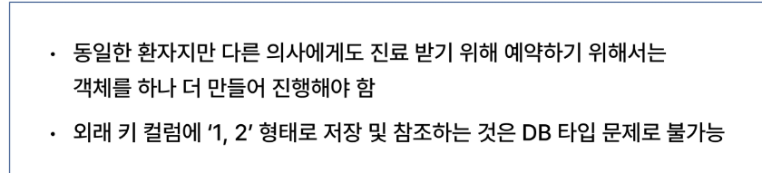
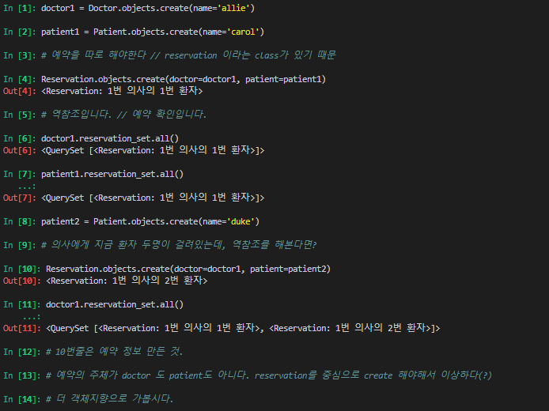
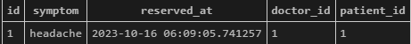

# 2023_10_16
오늘도 쉘플러스 
## Many to many relationships
- 한 테이블의 0개 이상의 레코드가 다른 테이블의 0개 이상의 레코드와 관련된 경우
- 양쪽 모두에서 N:1 관계를 가짐   
M:N 관계의 역할과 필요성 이해하기

### N:1 의 한계



### 중개 모델
예약 모델을 생성합니다. 
- 환자 모델의 외래 키를 삭제하고 별도의 예약 모델을 새로 생성한다.
- 예약 모델은 의사와 환자에 각각 N:1 관계를 가진다.


진료 예약 정보 :   
진료 확인법:   
Doc - Res   
P - Res  
테이블 확인하는 거?   - > 이 경우는 역참조입니다. // 역참조대상_set  = 역참조 매니저.

**역참조대상_set**
**역참조대상_set**
**역참조대상_set**





### ver.3 Many to many
- manay to many 의 경우 참조하는 테이블은 소문자 복수로 만들자.
- models.ManyToManyField(Doctor)

[ex_3.py](./99-mtm-practice/sample-model-code/ex_3.py)

shell 진행 내용입니다.

```py
In [1]: doctor1 = Doctor.objects.create(name='allie')
In [2]: patient1 = Patient.objects.create(name='carol')
In [4]: patient2 = Patient.objects.create(name='duke')
In [5]: patient1.doctors.add(doctor1)

In [6]: patient1.doctors.all()
Out[6]: <QuerySet [<Doctor: 1번 의사 allie>]>

In [7]: doctor1.patient_set.all()
Out[7]: <QuerySet [<Patient: 1번 환자 carol>]>

In [8]: # doctor class는 patients 라는 클래스가 없어서 안됨

In [9]: # 뭐 또 역참조 해야죠 뭐

In [10]: patient1.doctors.all()
Out[10]: <QuerySet [<Doctor: 1번 의사 allie>]>

In [11]: # 역참조 규칙

In [12]: doctor1.patient_set.all()
Out[12]: <QuerySet [<Patient: 1번 환자 carol>]>

In [13]: # 다대다에도 역참조가 있어요

In [14]: # 본인을 참조하는 키를 가진 것을 참조하는 것
In [15]: doctor1.patient_set.add(patient2)

In [16]: doctor1.patient_set.all()
Out[16]: <QuerySet [<Patient: 1번 환자 carol>, <Patient: 2번 환자 duke>]>
        # 의사가 직접 예약을 추가하는 것. # 역참조해서 추가해버린것 같아요. 아 맞네
In [17]: patient2.doctors.all()
Out[17]: <QuerySet [<Doctor: 1번 의사 allie>]> # 환자에게 따로 추가하지 않았지만, 잘 추가된 모습

# 의사가 하나 지워봤읍니다.!
In [18]: doctor1.patient_set.remove(patient1)

In [19]: doctor1.patient_set.all() # 의사가 지웠습니다.
Out[19]: <QuerySet [<Patient: 2번 환자 duke>]>

In [20]: patient1.doctors.all()
Out[20]: <QuerySet []> # 의사에서만 지웠지만 잘 지워진 모습 

# 환자가 의사를 지워봅니다.
In [21]: patient2.doctors.remove(doctor1)

In [22]: patient2.doctors.all() # 환자가 의사 지우고 확인
Out[22]: <QuerySet []>  # 잘 지워짐

In [23]: doctor1.patient_set.all() # 의사도 환자 확인
Out[23]: <QuerySet []> # 잘 지워짐

```

- patients 는 class에 doctors를 가지고 있지만(참조 가능),
- doctors 는 patients를 가지고 있지 않기 때문에 역참조를 또 해야한다. . . .
- ManyToMany는 종속관계가 아닙니다.
- 근데 여기는 진료 데이터만 있네요? 
  - 만약 예약 정보에 증상, 예약일 등 추가 정보가 필요하다면?

<hr>

```py
# models.py
# 참고용
class Doctor(models.Model):
    name = models.TextField()
    patients = models.ManyToManyField(Patient)
    # 이러면 순서가 바뀌고 아래의 doctors 의 models mtm 지워야겠지?
    def __str__(self):
        return f'{self.pk}번 의사 {self.name}'

class Patient(models.Model):
    # ManyToManyField 작성
    doctors = models.ManyToManyField(Doctor)
    name = models.TextField()

    def __str__(self):
        return f'{self.pk}번 환자 {self.name}'
```
<hr>

#### ex_5 (4랑 5 순서 바뀌었다고 합니다.)

달라진 점
- Patient에 through 생김
- Reservation 살아남.
  - 심지어 엄청 커짐
  - symptom
  - reserved_at 
- 예약을 위해서는 symptom을 작성할 필요가 있다.

```py
In [1]: doctor1 = Doctor.objects.create(name='allie')
   ...: 

In [2]: patient1 = Patient.objects.create(name='carol')
   ...: 

In [3]: patient2 = Patient.objects.create(name='duke')
   ...:

In [4]: reservation1 = Reservation(doctor=doctor1, patient=patient1, symptom='headache')
   ...:

In [5]: reservation1.save()
   ...:

In [6]: doctor1.patient_set.all()
Out[6]: <QuerySet [<Patient: 1번 환자 carol>]>

In [7]: patient1.doctors.all()
Out[7]: <QuerySet [<Doctor: 1번 의사 allie>]>

In [8]: reservation1
Out[8]: <Reservation: 1번 의사의 1번 환자>


In [12]: patient2.doctors.add(doctor1, through_defaults={'symptom': 'flu'})
    ...: 
```
결과: 



아까와 같이 add, remove 는 쓸 수 있으나, symptom 이 필요하다. : 12번 줄
through_defaults={'딕셔너리':'형태로'}

'through' : 의사와 환자가 각각 예약 삭제


#### M:N 관계 주요 사항
- M : N 관계로 맺어진 두 테이블에는 물리적인 변화가 없다. 
- ManyToManyField는 중개 테이블을 자동으로 생성
- ManyToManyField는 M:N 관계를 맺는 두 모델 어디에 위치해도 괜찮음
  - 대신 필드 작성 위치에 따라 참조와 역참조 방향을 주의
- N : 1 은 완전종속의 관계지만, M:N은 종속적 관계가 아니며 ' 의사에게 진찰받는 환자 & 환자를 진찰하는 의사' 이렇게 2 가지 형태 모두 표현이 가능 
'through' == 중개 테이블에 추가 데이터를 사용해 M:N 관계를 형성하려는 경우에 사용

### ManyToManyField(to, **options) : Many to many 관계 설정시 사용하는 필드
1. related_name
   - 역참조시 사용하는 manager name(_set) 을 변경
   - ex) doctors = models.ManyToManyField(Docktor, related_name='patients')
   - # 전 : doctor.patient_set.all()
   - # 후 : doctor.patients.all()
2. symmetrical 
   - ManyToManyField가 동일한 모델을 가리키는 정의에서만 사용
   - 기본값 True
   - 자기 자신을 참조하는 경우
   - 대칭이 켜져있는 경우(True인 경우) : A와 B를 A에서 연결하는 순간
   - B도 A가 연결됨
   - 팔로우 기능이 이런 것 >> 유저와 유저간의 다대다 관계 // 팔로우는 대칭이 아니다. 
3. through
   - 중개 테이블에 추가 데이터를 사용해 M:N 관계를 형성하려는 경우에 사용
M:N 에서의 methods
- add()
  - '지정된 객체를 관련 객체 집합에 추가' 
  - (이미 존재하는 관계에 사용하면 관계가 복제되지 않음)

- remove() 
  - '관련 객체 집합에서 지정된 모델 객체를 제거'

## 좋아요

유저 <-> 게시글 // User <-> Article

|유저|게시글|
|----|-----|
|U1|Art1|
|U2|Art1|
|U3|Art1|

요론

Article(M) - User(N)
- 0 개 이상의 게시글은 0 명 이상의 회원과 관련
- ManyToManyField는 편한곳에 두세요


<hr>
03-01-many-to-many로 이동

복수형으로 쓰라고 했는데 . . . users는 뭔가 직관성은 떨어져보여요. // 구문을 명시적으로 하자 like_users

[ 파일 만진 것 ](./lo_que_he_hecho.md)

Article : User(N:1)
N:1 에서의 역참조
- user.article_set.all()

Article : User (N:M)
N:M 에서의 역참조
- user.article_set.all()
  
*이 역참조 매니저  두개 중복이니까 해결해줘*

#### User - Article 간 사용 가능한 전체 related manager

1. article.user
   - 게시글을 작성한 유저 : N:1
2. user.article_set
   - 유저가 작성한 게시글(역참조) - N:1
3. article.like_users
   - 게시글을 좋아요 한 유저 M:N
4. user.like_articles
   - 유저가 좋아요 한 게시글 M:N

### 좋아요 기능 구현

1. URL : 누가, 어디에 눌렀는가!
   1. 누가
      - 검색은 article만 하면 됨
      - 좋아요를 누른다는 것은 결국 누군가가 로그인 되어있다는 것
      - request에 로그인한 유저의 정보가 들어있다.
2. views
   1. 별도 페이지가 필요한가? : No
   2. 어떤 글에 누른 것인가 
   3. 좋아요인가 좋아요 취소인가

3. 수정하고 나면 like user라는게 자연스럽게 나와있음 -> models에서 설정한게 그거였으니까.
4. 따라서 수정이 필요하다 forms.py


### 강사님 팁


DB -> class -> 이게 조금 더 ..


```py
# N : 1 
article = Article.objects.get(pk ==3)
article.user.username # 유저 이름 불러옴

user = User.objects.get(pk ==1) # 1번 유저 이리오너라
request.user.Article_set.all() # 1번유저 부검

# M : N
# 양측이 복수형인 경우, 중개 // 제 3자(내가 이해하려고 쓴거임) // 테이블이 필요함
# (Article) 1 : N (3자) | N(3자) : 1 (User)
# 중개테이블(3자)가 이 N : N 으로 이어준다(?)  
# class 개념의 모델링에서는,
article.like_users.all() # filter count queryset API 쓰면 된다.
```


|설명1| 설명2|설명3
|----|-----|----|
|articles_article_like_users|||
|앱이름|모델이름|related_name|

역참조 오류 : _set 이 기본이라서..?
> 역참조 이름 바꿔줌 : related_name='like_articles'

해시태그 : 모델 필요함
> 1. 게시글 필요함
> 2. 여러 게시글에 여러 해시태그가 들어갈 수 있다.
> 3. M:N 관계
> 4. 게시글 저장 시 태그를 중개테이블에 add 해주자!SSS