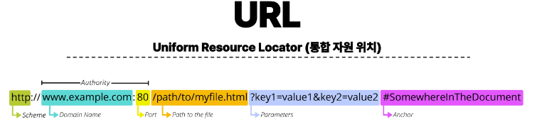
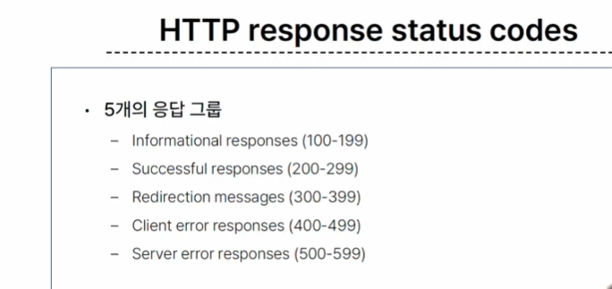

# 2023_10_18

# API
Application Programming Interface 
애플리케이션과 프로그래밍으로 소통하는 방법
> 클라이언트-서버 처럼 서로 다른 프로그램에서 요청과 응답을 받을 수 있도록 만든 체계
> 복찹한 코드를 추상화하여 대신 사용할 수 있는 몇 가지 더 쉬운 구문을!!!

## Web API
- 웹 서버 또는 웹 브라우저를 위한 API
- 현대 웹 개발은 하나부터 열까지 직접 개발하기 보다 여러 Open API를 활용하는 추세
- 대표적인 Third Party Open API
  - Youtube API
  - Google Map API
  - Naver Papago API
  - Kakako Map API
  
<hr>

# REST
<div> Representational State Transfer </div>
- API Server를 개발하기 위한 일종의 소프트웨어 설계 방법론 "약속(규칙X)"
  
## RESTful API 
- REST 원리를 따르는 시스템을 RESTful 하다고 부름
- "자원을 정의" 하고 "자원에 대한 주소를 지정" 하는 전반적인 방법을 서술
> " 각각 API 구조를 작성하는 모습이 너무 다르니 약속을 만들어서 다같이 통일해서 쓰자!"

## REST API
REST라는 설계 디자인 약속을 지켜 구현한 API
- 시작은 방법론이었으나, 대부분 잘 지키는 편

## REST 자원 정의 주소 지정
1. 자원의 식별
   - URI 
2. 자원의 행위
   - HTTP Methods // GET(뭔가 줘) POST (생성해 줘)
3. 자원의 표현
   - JSON 데이터
   - 궁극적으로 표현되는 데이터 결과물

### URI 
Uniform Resource Identifier (*통합자원 식별자*)  
인터넷에서 리소스(자원)를 식별하는 문자열  
- 가장 일반적인 URI는 웹 주소로 알려진 URL

### URL
Uniform Resource Locator (*통합자원위치*)  
웹에서 주어진 리소스의 주소
- 네트워크상에 리소스가 어디 있는지를 알려주기 위한 약속




1. Schema (or Protocol)
   - 브라우저가 리소스를 요청하는 데 사용해야 하는 규약
   - URL의 첫 부분은 브라우저가 어떤 규약을 사용하는지를 나타냄
   - 기본적으로 웹은 HTTP(S)를 요구하며 메일을 열기위한 mailto:, 파일을 전송하기 위한 ftp:등 다른 프로토콜도 존재
2. Domain Name
   - 요청중인 웹 서버를 나타냄
   - 어떤 웹 서버가 요구되는 지를 가리키며 직접IP 주소를 사용하는 것도 가능하지만, 사람이 외우기 어렵기 때문에 주로 Domain Name으로 사용 (원래 IP주소가 있지만 . . .)
   - ex) 도메인 google.com의 IP 주소는 142.251.42.142 <<외우기 어렵다!!>>
3. Port
   - 웹 서버의 리소스에 접근하는데 사용되는 기술적인 문(Gate)
   - HTTP 프로토콜의 표준 포트
   - HTTP - 80
   - HTTPS -443
   - 표준 포트만 생략 가능
4. Path
   - 웹 서버의 리소스 경로
   - 초기에는 실제 파일이 위치한 물리적 위치를 나타냈지만 (google.com/index.html 이런 물리적 주소)
   - 오늘날은 실제 위치가 아닌 추상화된 형태의 구조를 표현 (우리가 만든 메인 페이지의 주소도 /articles/였음, /articles/index.html이 아니라!!)
   - 예를 들어 /articles/create/가 실제 articles 폴더안에 create 폴더 내부를 나타내는 것은 아님.
5. Parameters
   - 웹 서버에 제공하는 추가적인 데이터. :ej: GET / 검색데이터  (서버측에서 데이터를 받기 위한 것)
   - '&' 기호로 구분되는 key-value 쌍 목록
   - 서버는 리소스를 응답하기 전에 이러한 파라미터를 사용하여 추가 작업을 수행할 수 있음
6. Anchor
   - 일종의 "북마크"를 나타내며 브라우저에 해당 지점에 있는 콘텐츠를 표시
   - fragment identifier(부분 식별자)라고 부르는 '#' 이후 부분은 서버에 전송되지 않음
   - https://docs.djangoproject.com/en/4.2/intro/install/#quick-install-guide 요청에서 #quick-install-guide는 서버에 전달되지 않고 브라우저에게 해당 지점으로 이동할 수 있도록 함  // 페이지 특정 위치에 슝~ 이동됨
   - "서버에서 처리 안함!!!!!!!!!!!!!!!!!!!"

### 자원의 행위 
HTTP Request Methods
리소스에 대한 행위(수행하고자 하는 동작)를 정의
> HTTP verbs 라고도 한다.

1. GET
   - 서버에 리소스의 표현을 요청
   - GET 을 사용하는 요청은 데이터만 검색해야 함
2. POST
   - 데이터를 지정된 리소스에 제출
   - 서버의 상태 변경 
3. PUT
   - 요청한 주소의 리소스 수정
4. DELETE 
   - 지정된 리소스 삭제

### HTTP response status codes
- 특정 HTTP 요청이 성공적으로 완료 되었는지 여부를 나타냄


### 자원의 표현
지금까지 서버가 응답했던 것 : Django 서버는 페이지만 응답하고 있었다 
- 사실 서버는 페이지 뿐 아니라 다양한 데이터 타입을 응답할 수 있음
- REST API는 이 중에서도 JSON 타입으로 응답하는 것을 권장

기존 : 페이지(html)만을 응답하는 서버 : render // 매 요청 이후 페이지가 새로고침 됨  
New :  이제는 JSON 데이터를 응답하는 REST API 서버로의 변환 + DJANGO는 더이상 Template부분에 대한 역할을 담당하지 않게 되며 Front-end와 Back-end가 분리되어 구성 됨  
>> Front-end, Framework 의 필요성!!
*장고 template 안녕!*
- 이제부터 Django를 사용해 RESTful API 서버를 구축할 것 // back-end
> JS 언어 학습 예정  
> Wa 풀스택!
>

파이썬 : JSON -> dict

- python으로 json 응답받기. . .

### Serialization "직렬화"
여러 시스템에서 활용하기 위해 데이터 구조나 객체 상태를 나중에 재구성 할 수 있는 포맷으로 변환하는 과정
> 어떠한 언어나 환경에서도 나중에 다시 쉽게 사용할 수 있는 포맷으로 변환하는 과정


쿼리셋(데이따)! -> 쓲싺쓲싺(serialization) -> 포장(serialized data) ->  와!  JSON/(etc 암튼 여러 타입!!!) !!! 

serialization... 클래스... 이것저것 할 수 있게 열심히 열심히 공부합시다.
어차피 장고를 사용하는 개발자가 사용하는 구조라서 model? 과 유사할지도 모릅니다.

## DRF with single model
setting.py 등록 해야해요.
> rest_framework

[여기서부터 약간의 실습](./한일.md/#10-1-로-갑니다)

url은 두개지만 기능은 5개!!!
- method로 행위를 지정하기 때문에 url 두개로 충분하다.

- ModelSerializer - Django 모델과 연결된 Serializer 클래스
1. Get 
   1.  list
   - 똑같은 데이터를 HTML에 출력되도록 페이지와 함께 응답했던 과거의 view 함수
   - JSON 데이터로 serialization 하여 페이지 없이 응답하는 현재의 view 함수
'api_view' decorator
- DRF view 함수에서는 필수로 작성되며 view 함수를 실행하기 전 HTTP 메서드를 확인
- 기본적으로 GET 
- 교 60
   2. Detail 


2. [POST](./한일.md/#post)
   - 게시글 데이터 생성하기
   - 데이터 생성이 성공했을 경우 : 201 Created 를 응답
   - 데이터 생성이 실패했을 경우 : 400 Bad request를 응답
   - 함수 구조 변경 할 것 (method에 따른 분기처리)
   - 이유1 : 템플릿 필요 없음, 분기처리만 해주면 된다.
   - 이유2 : 기존의 사용하던 URL 마구마구 만들던 방식은 REST에 맞지 않음. REST에서 URL은 위치! 행위는 METHOD로 !
   - key 매우 중요합니다. shell의 key = asdjaslkdj, content = asjdasdlkjaslkd 이렇게 저장했던 것 처럼<br>
<p>

<br>
<br>
<br>


## [DELETE ](./한일.md/#delete)

## [PUT](./한일.md/#put수정)

훗날 실제로 제공하는 것은 아까 했던 파이썬 파일과 같은 python-request-sample.py 이런 것을 통한 소통을 하게 됨.

request 라이브러리로 요청 > 이후 뭔가 잘 함


### 참고 자료

- is_valid() 는 유효성 검사 오류가 있는 경우 ValidationError 예외를 발생시키는 선택적 raise_exception 인자를 사용 할 수 있다.
- DRF에서 제공하는 기본 예외 처리기에 의해 자동으로 처리되며, 기본적으로 HTTP 400 응답을 반환
```py
# articles/views.py

@api_view(['GET', 'POST']) # GET,POST 일때만 반응하는 함수라고 알림
def article_list(request):
    if request.method == 'GET':
        articles = Article.objects.all()
        serializer = ArticleListSerializer(articles, many=True)
    # 이제 파이썬만 다루는 것이 아닌, 유연한 데이터를 다룰 것. 
    # 따라서 serializer import 
    # many=True 해주셔야 해용
        return Response(serializer.data)
    # Response도 따로 임포트!
    # DRF view 함수에는 데코레이터가 필수적이다. 그렇지 않으면 작동하지 않음
    
    elif request.method == "POST": # ELSE 도 되지만 명시적으로 하기 위함: ELIF
        # form = ArticleForm(request.POST) 기존 방식
        serializer = ArticleSerializer(data=request.data)
        if serializer.is_valid(raise_exception=True): # 유효성 검사, 기본 처리기에 의해 자동으로 처리 400 반환
            serializer.save() # 이름만 같은것... 저장의 기능은 같다.
        return Response(serializer.data, status=status.HTTP_201_CREATED) # 상태코드 import
   #  return Response(serializer.errors, status=status.HTTP_400_BAD_REQUEST) 이거 대신
```