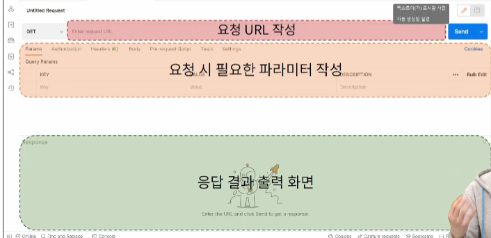
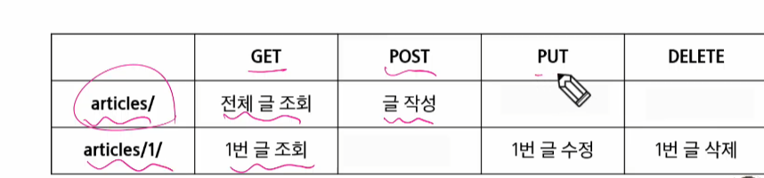

# articles.Serializer

```py
class ArticleSerializer(serializers.ModelSerializer):

    class Meta:
        model = Article
        fields = '__all__'
        # 모델이랑 비슷하네요?
```
# view 구경중
```py
@api_view()
def article_json(request):
    articles = Article.objects.all() # 위의 쿼리셋을 인자로 받아서
    serializer = ArticleSerializer(articles, many=True) # 모델폼 비슷한 친구
    return Response(serializer.data) # 결과를 응답중.... context ={'a':a} 가 사라짐
    # render(request, template, context)
```
api/v1/articles : 주소였음

1. 터미널 분할
2. 혹시 모르니까 일단 두번쨰 터미널의 가상은 종료하고 돌려봅시다.
[python으로 json 응답받기. . .](./99-json-response-practice/python-request-sample.py)


# 10-1 로 갑니다.
Postman 설치
가상 설치






|  |GET|POST|PUT|DELETE|
|---|---|---|---|---|
|articles/|전체 글 조회| 글 작성 |  |  |
|articles/1/| 1번글 조회| | 1번 글 수정| 1번 글 삭제| 

## Get - list (1/3)
- 게시글 데이터 목록 조회하기
- 게시글 데이터 목록을 제공하는 articlelistserializer 정의
  
1. app 폴더 : serializers.py // serializers도 일반 or model 두개 종류 있음 

```py
from rest_framework import serializers
from .models import Article


class ArticleListSerializer(serializers.ModelSerializer):
    class Meta:
        model = Article
        # 해당 모델
        fields = ('id', 'title', 'content',) 
        # 어떤 필드를 보여줄것인가.
        # 이름이 꼭 이것도 아니고, 꼭 여기에 없어도 됨. 그냥 여기에 두고 편하게 관리하자는 의미

```
articles/ url
```py
    path('articles/', views.article_list),# 이름은 템플릿에서 쓰던거라 지정 안했어요
```

articles/view
```py
# 임포트 참 많이 해야합니다.
from .models import Article
from .serializers import ArticleListSerializer
from rest_framework.response import Response
from rest_framework.decorators import api_view # drf 규칙. 데코레이터를 달아라.

@api_view(['GET']) # GET 일때만 반응하는 함수라고 알림
def article_list(request):
    articles = Article.objects.all()
    serializer = ArticleListSerializer(articles, many=True)
    # 이제 파이썬만 다루는 것이 아닌, 유연한 데이터를 다룰 것. 
    # 따라서 serializer import 
    # many=True 해주셔야 해용
    return Response(serializer.data)
    # Response도 따로 임포트!
    # DRF view 함수에는 데코레이터가 필수적이다. 그렇지 않으면 작동하지 않음
```

~~*template 작성 안할 것*~~

GET - Detail

serializers
```py
# 전체 필드 출력용  
class ArticleListSerializer(serializers.ModelSerializer):
    class Meta:
        model = Article
        fields = '__all__'

# urls.py
urlpatterns = [
    path('articles/<int:article_pk>/', views.article_detail),
]

# views.py
from .serializers import ArticleSerializer # 디테일 보는 serializers
# 위에서 만든 serializer import
@api_view(['GET'])
def article_detail(request,article_pk):
    article = Article.objects.get(pk=article_pk)
    serializer = ArticleSerializer(article) # 단일 이므로 Many X  // 기본이 many
    return Response(serializer.data)
```

## Post

```py
# views. article_list
@api_view(['GET', 'POST']) # GET,POST 일때만 반응하는 함수라고 알림
def article_list(request):
    if request.method == 'GET':
        articles = Article.objects.all()
        serializer = ArticleListSerializer(articles, many=True)
    # 이제 파이썬만 다루는 것이 아닌, 유연한 데이터를 다룰 것. 
    # 따라서 serializer import 
    # many=True 해주셔야 해용
        return Response(serializer.data)
    # Response도 따로 임포트!
    # DRF view 함수에는 데코레이터가 필수적이다. 그렇지 않으면 작동하지 않음
    
    elif request.method == "POST": # ELSE 도 되지만 명시적으로 하기 위함: ELIF
        # form = ArticleForm(request.POST) 기존 방식
        serializer = ArticleSerializer(data=request.data)
        if serializer.is_valid(): # 유효성 검사. 이름만 같은 뿐 (drf)
            serializer.save() # 이름만 같은것... 저장의 기능은 같다.
        return Response(serializer.data, status=status.HTTP_201_CREATED) # 상태코드 import
    return Response(serializer.errors, status=status.HTTP_400_BAD_REQUEST)
        # 브라우저에서 뭔가 하긴 힘듬 -> 템플릿 음슴
```

## DELETE

```py 
# views.py
@api_view(['GET', 'DELETE']) # method 써주고
def article_detail(request,article_pk): 
    article = Article.objects.get(pk=article_pk) # 글은 필요하니까 조건문 이전에.
    if request.methdo == 'GET': # 여기 추가
        serializer = ArticleSerializer(article) # 단일 이므로 Many X  // 기본이 many
        return Response(serializer.data)
    elif request.method == 'DELETE': # 여기 추가 
        article.delete()
        return Response(status=status.HTTP_204_NO_CONTENT) # 삭제로 인해 content 가 없어요. 명확한 삭제 성공을 의미합니다.
```

## PUT수정

```py
# views.py
@api_view(['GET', 'DELETE','PUT'])
def article_detail(request,article_pk):
    article = Article.objects.get(pk=article_pk)
    if request.method == 'GET':
        serializer = ArticleSerializer(article) # 단일 이므로 Many X  // 기본이 many
        return Response(serializer.data)
    elif request.method == 'DELETE':
        article.delete()
        return Response(status=status.HTTP_204_NO_CONTENT) # 삭제로 인해 content 가 없어요. 명확한 삭제 성공을 의미합니다.
    elif request.method=='PUT':
        # form = ArticleForm(request.POST, instance=article) # 기존
        serializer = ArticleSerializer(article, data=request.data)
        # form = ArticleForm(instance=article, data=request.data )
        if serializer.is_valid():
            serializer.save()
            return Response(serializer.data, status.HTTP_200_OK) # 수정 결과와, 200 ok 신호 
    #실패했을 때
        return Response(status=status.HTTP_400_BAD_REQUEST)
```

chrome -> json  Viewer 이런거 확장 하나 깔아주면 잘 보이는듯 싶습니다.? 