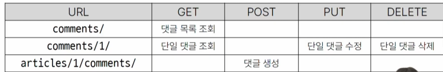
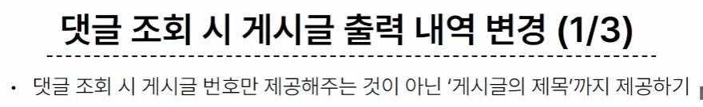

# 2023_10_19


# 1. 포스트맨

# 2. load data and setting + antes de la empieza del curso
```bash
$ python manage.py loaddata articles.json
Installed 20 object(s) from 1 fixture(s)
```
## 어제 (10_18) 한 "PUT"을 이용한 수정은 무조건 content와 title 둘 다 수정을 해야 했음!
> is_vaild() 에서 비어있는 필드가 발견되어 400 Bad Request 가 나온 것.
> serializer 의 fields 를 유심히 보자
- fields = '__all__' 에서 validation 된 듯 ?  // is_valid() 가 title 과 content 를 둘다 확인 함
- drf는 기본적으로 '__all__'을 해버린다면, 모든 필드에 대해 유효성 검사를 진행함
  - [현재 필요한 것은 *일부* 데이터 수정이 필요한 것.](한일.md/#put)

# DRF N:1
model -> comment 정의

URL 및 HTTP request method 구성



|URL|GET|POST|PUT|DELETE|
|--|--|--|--|--|
|comments/|댓글목록조회| X | X | X |
|comments/1|단일댓글조회| X | 단일댓글수정 | 단일댓글삭제 |
|articles/1/comments/|X|댓글 생성 | X | X |


## GET - list
- 댓글 목록 조회를 위한 CommentSerializer 정의 (변환기)


> [serializers.py](./한일.md)

JSON은 사실 문자열임...  
외래키를 확인할 수 있음 : n번 article에 해당한다는 것을 볼 수 있다!! 

create 시 article 관련 오류 발생 // 유효성 검사 이후 article을 전송했기 때문
- 최종적으로 댓글이 만들어 졌을 때, 조회는 가능하면서 유효성 검사에서는 제외되어야 한다.
- 읽기 전용 필드
  - 데이터를 전송하는 시점에 "유효성 검사에서 제외시키고, 데이터 조회 시에는 출력" 하는 필드
-> articles/serializer 에서 수정!! 

# [응답 데이터 재구성](./한일.md/#응답-데이터-재구성)
- comment의 article 번호를 어떻게 활용할 것인가???
- client 는 20 추출 -> 20 번 게시글 조회 // 복잡하다.
- 참조상태의 재구성



- 댓글 조회 시 게시글 번호만 제공해주는 것이 아닌 '게시글의 제목' 까지 제공하기


# [역참조 데이터 구성](./한일.md/#역참조-데이터-구성)
Article -> Comment 간 역참조 관계를 활용한 JSON 데이터 재구성
1. 단일 게시글 조회 시 해당 게시글에 작성된 댓글 목록 데이터도 함께 붙여서 응답
   - 기존 field
2. 단일 게시글 조회 시 해당 게시글에 작성된 댓글 개수 데이터도 함께 붙여서 응답
   - 새로운 field 

역참조 이름 바꾸기? -> models.py // related_name

**source**
- 필드를 채우는데 사용할 속성의 이름
- 점 표기법(dotted notaion)을 사용하여 속성을 탐색할 수 있음

!주의!
- 특정 필드를 override 혹은 추가한 경우 read_only_fields는 동작하지 않음
- 해당 필드의 read_only 키워드 인자로 작성해야 한다.


# [API 문서화](./한일.md/#API문서화)

OpenAPI Specification (OAS) 
- RESTful API를 설명하고 시각화 하는 표준화 된 방법
- API에 대한 세부사항을 기술할 수 있는 공식 표준
OAS의 핵심 이점 - "설계 우선" 접근법
- API 를 먼저 설계하고 명세를 작성한 후, 이를 기반으로 코드를 구현하는 방식
- API 의 일관성을 유지하고, API 사용자는 더 쉽게 API를 이해하고 사용할 수 있음
- 또한 OAS를 사용하면 API가 어떻게 작동하는지를 시각적으로 보여주는 문서를 생성할 수 있으며, 이는 API를 이해하고 테스트하는 데 매우 유용
- 이런 목적으로 사용되는 도구가 아래의 두개.
    1. Swagger // 
    2. Redoc // 
> 2개의 프레임워크 有 // 스타일이 다름. . .
와 통합한 라이브러리!! 그는 신이야!! 
drf-spectacular 라이브러리

url 구경 잘 해보기

잘 만져서 문서화 하는 것.
- drf spectacular 문서를 잘 보면서 custom 하는 방법을 확인해야겠죠. . . 


참고:
Django shortcuts funcutions
혼자 궁금한 것 
> render & redirect 의 차이는? ? ? 
>
> 
1. render()
   - 
2. redirect()
   - 
3. [get_object_or_404()](한일.md/#get_object_or_404)
   - api 만들 때 필요
   - 모델 manager objects에서 get()을 호출하지만, 해당 객체가 없을 땐 기존 DoesNotExist 예외 대신 Http404를 raise 함
   - 찾고자 하는 것이 없을 때 서버를 끄는게 아니라, 올바른 응답 상태를 주는 기능이 필요하다.
   - try except ?:? >>  최소 4줄의 코드가 필요함 // 이 함수로는 한줄로 가능합니다.
   - 없는 이상한 사이트 보내면 500 error 발생함. < 그렇지만 클라이언트 잘못인걸요?
   - 서버는 이를 정확하게 말해줄 수 있어야 함. :: 매우매우매우매우 중요해요 
   - 단일 데이터 조회 모든 코드에 적용 가능
```py
# 기존 코드
article = Article.objects.get(pk=article_pk)

# 수정 후 코드
article = get_object_or_404(Article, pk= article_pk)

# 만약 해당 코드가 없다면
try:
  article =Article.objects.get(pk=article_pk)
except:
  return HTTP...
```
4. [get_list_or_404()](한일.md/#get_list_or_404())
   - api 만들 때 필요
   - 모델 manager objects에서 filter()의 결과를 반환하고, 해당 객체 목록이 없을 땐 Http 404 를 raise함
   - 다중 데이터에 사용.
   - ej) articles = ARticle.objects.all()을 대체 가능하다
   - MTV 패턴에서 index view 함수에 get_list_or_404하면 불편해집니다.
```py
def index(request):
    articles = get_list_or_404(Article)
    # 이러면 게시글 없으면 404 에러 나와버리는지라, 그닥 추천하지는 않는 행동입니다.
    # 메인 페이지를 볼 수 없을걸요?
```
따라서 위의 두개의 shortcut 은 적합한 사용처가 있다. ( API 개발)

###  사용 이유 
- 클라이언트에게 '서버에 오루가 발생하여 요청을 수행할 수 없다(500)' 라는 원인이 정확하지 않은 에러를 제공하기 보다는, 적절한 예외 처리를 통해 클라이언트에게 보다 정확한 에러 현황을 전달하는 것도 매우 중요한 개발 요소 중 하나이기 때문.

야호
- 장고는 사이드의 느낌으로 후반에 등장할 예정!!
- 안녕!
