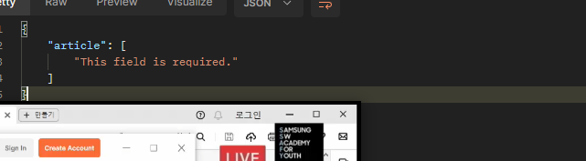

# PUT

일부분에 대한 수정을 위한 수정  

```py
# views.py > article_detail > PUT
serializer = ArticleSerializer(article, data=request.data ) # 수정 전 
serializer = ArticleSerializer(article, data=request.data, partial=True ) # 수정 후 
# 일부분을 의미하는 인자인 partial=True 를 넣어주자.
```

# N:1 Comment
```py
# models.py
# 1. Comment 정의
class Comment(models.Model):
    # 외래키는 N 이 가진다.
    # 하나의 게시글에 여러 글이 작성되는 구조기 때문
    article = models.ForeignKey(Article, on_delete=models.CASCADE) # 그 글이 사라지면 참조되던 댓글이 사라지는 옵션
    content = models.TextField()
    created_at = models.DateTimeField(auto_now_add=True)
    updated_at = models.DateTimeField(auto_now=True)

# 2. serializer.py
#  serializer 정의 & import Comment model 
class CommentSerializer(serializers.ModelSerializer):
    # modelform과 비슷한것입니다.
    class Meta:
        model = Comment 
        fields = '__all__'
# 3. Urls.py
path('comments/', views.comment_list), # 전체조회

# 4. views.py  - comment_list 정의
# 4-1. comment model import, serializer import 
@api_view(['GET'])  # 라이브러리 약속임
def comment_list(request):
    comments = Comment.objects.all()
    serializer = CommentSerializer(comments,many=True)
    return Response(serializer.data)


# DETAIL // GET
@api_view(["GET"])
def comment_detail(request, comment_pk):
    comment = Comment.objects.get(pk=comment_pk)
    serializer = CommentSerializer(comment)
    return Response(serializer.data)
# 다시 url  -- comment/comment_pk - detail
path('articles/<int:article_pk>/comments/create', ) # URL에 행위에 대한 의미가 있는 것은 지양하자.
path('articles/<int:article_pk>/comments/', views.comment_create ), # 행위는 POST 같은 method로 전송하자.

# Create // POST // view, url 따로... 또 만들어요
@api_view(["POST"])
def comment_create(request, article_pk):
    article = Article.objects.get(pk=article_pk)
    serializer = CommentSerializer(data=request.data) # 여기에 사용자가 입력한 것이 들어있을 것
    # if serializer.is_vaild(): # 유효성 검사
    if serializer.is_valid(raise_exception=True):
        serializer.save(article=article ) # comment에 article 필드가 누락됨
        return Response(serializer.data, status=status.HTTP_201_CREATED)
    # return Response(serializer.error, status=status.HTTP_400_BAD_REQUEST)

# 읽기 전용 필드 추가 // 유효성 검사에서 article을 제외한다. 
# serializers.py
class CommentSerializer(serializers.ModelSerializer):
    # modelform과 비슷한것입니다.
    class Meta:
        model = Comment 
        fields = '__all__'
        read_only_fields = ('article',) # 유효성 검사 통과를 위한 읽기 전용 설정

# DELETE & PUT // article과 유사하다 // comment_detail

# views.py
```

에러!!!!!!!!!! 


# 응답 데이터 재구성

```py
# serializers.py
class CommentSerializer(serializers.ModelSerializer):
    # 여기서만 쓸꺼라서 ㅋㅋ.. 겹쳐도 됩니다.
    class ArticleSerializer(serializers.ModelSerializer):
        class Meta:
            model = Article
            fields = ('title',)

    # 오버라이드 할 것입니다.
    article = ArticleSerializer(read_only=True) # 아래의 코드는 문법적 오류가 발생
    # modelform과 비슷한것입니다.
    class Meta:
        model = Comment 
        fields = '__all__'
        # read_only_fields = ('article',) # 기본 필드에 대한 것
```

# 역참조 데이터 구성

```py
# 1. 단일 게시글 조회 시 해당 게시글에 작성된 댓글 목록 데이터도 함께 붙여서 응답
# serializers.py
# 1. 클래스 재활용 위한 선언 순서 변경
class ArticleSerializer(serializers.ModelSerializer):
    comment_set = CommentSerializer(many=True, read_only=True) 
    # 1 -> N 참조 중 // 댓글이 몇개건 다중 데이터가 나옴
    # 읽기 전용으로 변경할 것
    class Meta:
        model = Article
        fields = '__all__'
# 짜잔


# 2. 단일 게시글 조회 시 해당 게시글에 작성된 댓글 개수 데이터도 함께 붙여서 응답
# 위에 수정된 클래스에 아래를 추가해줌 (comment_set 아래)
# 댓글 수 만큼 출력해주는 것
# ArticleSerializer 는 article model에 기반해서 만들어집니다.
# 이를 응용해서 아래에 넣어줍니다.
# 얘도 read only
comment_count = serializers.IntegerField(source='comment_set.count', read_only=True)
```

# API문서화

```base
pip install drf-spectacular
+ settings 등록
+ pip freeze > requirements.txt
```
초반 설정 복붙 코드 찾으러 갑시다.
and finally register our spectacular AutoSchema with DRF. 자동 스키마 등록  

```py
settings.py
REST_FRAMEWORK = {
    # YOUR SETTINGS
    'DEFAULT_SCHEMA_CLASS': 'drf_spectacular.openapi.AutoSchema',
}
# 아무데나

SPECTACULAR_SETTINGS = {
    'TITLE': 'Your Project API',
    'DESCRIPTION': 'Your project description',
    'VERSION': '1.0.0',
    'SERVE_INCLUDE_SCHEMA': False,
    # OTHER SETTINGS
}
# 이건 default

# url 제공해주는 무언가 : 
# project.urls.py
from drf_spectacular.views import SpectacularAPIView, SpectacularRedocView, SpectacularSwaggerView

path('api/schema/', SpectacularAPIView.as_view(), name='schema'),
path('api/schema/swagger-ui/', SpectacularSwaggerView.as_view(url_name='schema'), name='swagger-ui'),
path('api/schema/redoc/', SpectacularRedocView.as_view(url_name='schema'), name='redoc'),

```

# get_object_or_404()

```py

# 기존 코드
article = Article.objects.get(pk=article_pk)
comment = Comment.objects.get(pk=comment_pk)

# 수정 후 코드
article = get_object_or_404(Article, pk= article_pk)
comment = get_list_or_404(Comment,pk=comment_pk)

# 만약 해당 코드가 없다면
try:
    article =Article.objects.get(pk=article_pk)
except:
    return HTTP...
```

# get_list_or_404()
```py
# 수정 전
articles = Article.objects.all()
comments = Comment.objects.all()

# 수정 후 
articles = get_list_or_404(Article)
comment = get_list_or_404(Comment)

```