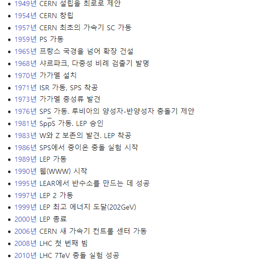
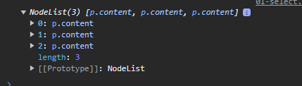
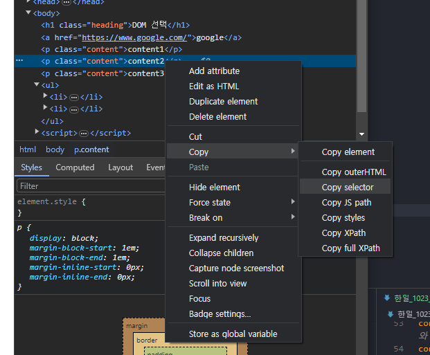

# 2023_10_23

# JavaScript

와 ! 웹 역사!! 진짜 !! 멋집니다!! 

## 웹의 역사
### 1990
팀 버니스리 경 
- WWW. 하이퍼텍스트
- URL, HTTP 최초 설계 & 구현
- 초기 웹은 정적인 텍스트 페이지만 지원
- 와! 유럽입자물리연구소!! 초 미니 블랙홀 있습니다!!!! 우와!!!!  (LHC)


- 쿨가이답게 특허 풀어버림

### 1993 웹 브라우저의 대중화
Netscape사의 최초 사용ㅇ 웹 브라우저 Netscape Navigator

### 1995 JavaScript의 탄생 
- Brandon Eich - 웹 동적 기능 개발 이라는 회사 요구를 넘어 스크립트 언어Mocha 개발
- 이후 LiveScript로 이름 변경 - 가장 인기있던 Java의 명성에 기대보고자 JavaScript로 이름 변경
- Netscape Nav 2.0에 동적 기능 추가에 사용됨 !!!

### 1996 JavaScript 파편화
- MS가 IE 3.0에 JavaScript 와 유사한 언어인 JavaScriptcript를 도입
- 이 과정에서 많은 회사가 자체적으로 JavaScript를 독자적으로 변경하고 이를 자체 브라우저 탑재 -> 파편화 시작

### 1995-2001 1차 브라우저 전쟁
- MS는 IE를 윈도우 운영체제에 내장하여 무료배포
- 빌게이츠 필두 MS의 공격적 마케팅, 자금력 윈도우 운영체제 점유율에 Netscape 빠르게 몰락시작
- 2002년 약 IE 96%의 점유율 = MS 승리
- Brandon Eich + 개발진 -> Firefox

#### **1차 브라우저 전쟁의 영향**
- 웹 표준의 부재로 인해 각 기업에서 자체 표준을 확립하려는 상황이 벌어짐 
- 웹 개발자들에게 큰 혼란, 웹 표준의 중요성을 인식하는 계기가 됨

### 1997 ECMAScript 출시 
- JavaScript 파편화 막기 위해 1997 ECMA에서 ECMAScript라는 표준 언어 정의
- 이떄부터 JavaScript는 이 표준에 기반 두고 발전 시작

### 2004- 2017 2차 브라우저 전쟁
- IE의 독주에 대한 Firefox의 대항 2008까지 30%까지 점유율 차지 
- 2008 Chrome 브라우저 출시 
- Chrome은 출시 3년 만에 Firefox의 점유율 돌파, 반년 뒤 IE 점유율 넘어섬
- Chrome은 웹 표준을 잘 준수해요
- 웹 기능 확장되며 웹 app의 비약적 발전을 이끌었음
  > 웹의 기술적 발전과 웹 표준의 중요성

## ECMAScript : 
Ecma International *정보와 통신 시스템을 위한 국제적 표준화 기구*이 정의하고 있는 표준화된 스크립트 프로그래밍 언어 명세
> 스크립트 언어가 준수해야 하는 규칙, 세부사항 등 제공.

## ECMAScript와 JavaScript
- JavaScript 가 이 표준을 잘 구현한 구체적 프로그래밍 언어
- ECMAScript의 명세 기반, Node.JavaScript 같은 환경에서 실행됨
> ECMAScript는 JavaScript의 표준이며, JavaScript는 ECMAScript표준을 따르는 구체적인 프로그래밍 언어  
> ECMAScript는 언어의 핵심을 정의하고 JavaScript는 ECMAScript 표준을 따라 구현된 언어로 사용됨
>
> 
## ECMAScript의 역사
- ECMAScript 5 (ES5)에서 안정성 생산성을 크게 높임(2009)
- ECMAScript 2015(ES6)에서 객체지향 프로그래밍 언어로써 많은 발전 이루어 역사상 가장 중요한 버전으로 평가됨(2015)

## JavaScript의 현재
- 많은 웹브 있음 -> 기존 JavaScript는 브라우저에서만 웹 페이지의 동적인 기능 구현에만 사용되었음
  - ex) 사용자의 입력에 따라 웹 페이지의 내용이 동적으로 변경되거나, 애니메이션 효과가 적용되는 등의 기능
- 이후 브라우저에서 벗어나 Node.JavaScript와 같은 서버 사이드 분야 뿐 아니라, 다양한 프레임워크와 라이브러리들이 개발되면서, 웹 개발 분야에서는 필수적 언어로 자리잡음. (점유율 ㅎㄷㄷ)

<hr> 서론 끝

# JavaScript and DOM
- 중요 : 오늘은 문법 안함 
- 몰라도 쓸 수 있어요, 우리는 처음으로 프로그래밍 언어 배우는거 아니니까요 ^^;;;
- 웹 브라우저 JavaScript를 배울 예정!!!!!!!!!!!!!
  - 가장 기본적인

## JavaScript 실행 환경 종류
   [한 일](한일_1023_js.md)
1. HTML script 태그
2. js 확장자 파일
3. 브라우저 Console
   
## DOM 
- The Document Object Model
- 웹 페이지(Document)를 구조화된 객체로 제공하여 프로그래밍 언어가 페이지 구조에 접근할 수 있는 방법을 제공
> 문서 구조, 스타일, 내용 등을 변경할 수 있도록 함  
> h1 태그라던지 그런 것을 선택할 수 있어야 함  
> *선택*하고 *조작*도 할 수 있어야 함  
> ej) Django에서 수정 or 다른 작업할 때 처럼 조회해야 함  
> 

## 특징 :
- DOM에서 모든 요소, 속성, 텍스트는 하나의 객체 
- 모두 document 객체의 자식으로 구성됨 . . .
  

## Dom tree 
- 브라우저는 HTML 문서를 해석해 Dom tree라는 개체 트리로 구조화
> 객체 간 상속 구조가 존재
>
> CSS때 "선택자" // 자손 ,자식 etc 선택자
>
> JS 도 그대로 씀
- 최종적으로 웹 페이지는 웹 브라우저를 통해 해석되어 웹 브라우저 화면에 나타난다.
  - CSS + JS + HTML = 사이?트?

## DOM 핵심
- 문서의 요소들을 객체로 제공하여 다른 프로그래밍 언어에서 접근하고 조작할 수 있는 방법을 제공하는 API

### 'document' 객체
- 웹 페이지 객체
- DOM Tree의 진입점
- 페이지를 구성하는 모든 객체 요소를 포함

- "근본적"으로 문서 조작

## DOM 조작 시 기억해야 할 것
- 웹 페이지를 동적으로 만들기 == 웹 페이지 조작하기
- 조작 순서
  1. 조작 하고자 하는 요소를 **선택**(또는 탐색)
  2. 선택된 요소의 콘텐츠 또는 속성을 **조작**

# DOM 선택
- document.querySelector()
  -  요소 한 개 선택 
-  document.querySelectorAll()
   -  요소 여러 개 선택

아이고... 파스칼 / 카멜 케이스 . . . 


## document.querySelector(selector)
- 제공한 선택자와 일치하는 element 한 개 선택
> 제공한 CSS selector를 만족하는 첫 번째 element 객체를 반환 (없다면 null 반환) / Python에선 None JS에선 Null

## document.querySelectorAll(selector)
- 제공한 선택자와 일치하는 여러 element를 선택
> 제공한 CSS selector를 만족하는 NodeList를 반환
>
> 배열처럼 뭔가 쓸 수 있다(?)
console.log(document.querySelectorAll('.content'))
> 
>
>    
# [1번 파일](한일_1023_js.md/#1번-파일)

- 확인은 항상 console
- 선택하고 출력도 안하고 다른것도 안함

- 진짜 위에서부터 한개만 선택하네

 이렇게 원하는 것 선택자 복사 가능
```body > p:nth-child(4)```

## DOM 조작
### 속성(attribute) 조작
2번 파일 - h1 빨간색 ㄱ ㄱ 
#### 1. 클래스 속성 조작 
 - 'classList' property // 요소의 클래스 목록을 DOMTokenList(유사 배열) 형태로 반환
 - 요소.classList
 - 변수.속성 or 변수.메서드

classList 메서드
- element.classList.add()
- element.classList.remove()
- element.classList.toggle()
  - class가 존재한다면 삭제, 없다면 추가

#### 2. 일반 속성 조작
- Element.getAttribute()
  - 해당 요소에 지정된 값 반환 (조회)
- Element.setAttribute(name, value)
  - 지정된 요소의 속성 값을 설정
  - 속성이 이미 있으면 기존 값을 갱신 (그렇지 않으면 지정된 이름과 값으로 새 속성추가)
- Element.removeAttribute(요소이름)
  - 요소에서 지정된 이름을 가진 속성 제거

### HTML 콘텐츠 조작
'textContent' property
> 요소의 텍스트 콘텐츠 표현
> ```<p> lorem </p>```
>
3번

### DOM 요소 조작 / 큰 단위 조작
### DOM 요소 조작 메서드 // DOM 은 상속구조
- document.createElement(tagName)
  - 작성한 tagName의 HTML 요소를 생성하여 반환
- Node.appendChild()
  - 한 Node를 특정 부모 Node의 자식 NodeList 중 마지막 자식으로 삽입
  - 추가된 Node 객체를 반환 
- Node.removeChild()
  - DOM에서 자식 Node를 제거
  - 제거된 Node를 반환

> js는 비동기적으로 처리함 . . .
>

### style 조작
'style' property
> 해당 요소의 모든 style 속성 목록을 포함하는 속성
5번 파일!! 


# 참고 : 
## Node
- DOM의 기본 구성 단위
- DOM 트리의 각 부분은 Node라는 객체로 표현
  - Document Node : HTML 문서 전체를 나타내는 노드
  - Element Node : HTML 요소를 나타내는 노드 ex p
  - Text Node : HTML 텍스트, Element Node 내의 텍스트 컨텐츠를 나타냄
  - Attribute Node : HTML 요소의 속성을 나타내는 노드
  - 
## NodeList
- DOM 메서드를 사용해 선택한Node의 목록
- 배열과 유사한 구조를 가진다.
- Index로만 각 항목에 접근 가능
- 다양한 배열 메서드 사용 가능
- querySelectorAll()에 의해 반환되는 NodeList는 DOM의 변경사항을 실시간으로 반영하지 않음.

## Element
- Node 의 하위 유형 
- Element는 DOM 트리에서 HTML 요소를 나타내는 특별한 유형의 Node
- 예를 들어, 
- ```<p>, <div>, <span>, <body>``` 등의 HTML 태그들이 노드를 생성
- Node의 속성과 메서드를 모두 가지고 있으며 추가적으로 요소 특화된 기능(ej: className, innerHTML, id 등)을 가지고 있음
> 모든 Element는 Node지만, 모든 Node가 Element인건 아님.
## 확인 팁 :  
- 개발자도구 elemnets properties
- 해당 요소의 모든 DOM 속성 확인 가능