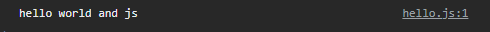
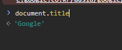
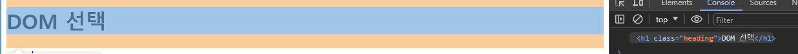

# hello world

## hello.html

```html
<body>
  <script>
    console.log('hello world')
  </script>
</body>
```
콘솔에 나온다.

## hello.js and hello.html
```js
console.log('hello world and js')
html :>
  <script src="hello.js"></script>
```

## 브라우저 콘솔에서 해도 됨


뭐 그래요.


## GOOGLE
```js
// google에서 진행 
document.title // 1 
document.title = '집가고싶다' // 2

```

1 - 

<br>

2 - 

2 -  ㅋㅋㅋㅋ

# 선택

## 1번 파일
- 01_select.html

css 선택자와 똑같은 선택자

.heading 이렇게
```js
document.querySelector('.heading') // 그냥 선택임
console.log(document.querySelector('.heading')) // 와 ! // 1  
console.log(document.querySelectorAll('.content')) // 2

console.log(document.querySelectorAll('ul > li')) // 자식선택자 . . . 3 

```
1 - 

2 -   
인덱스 접근 가능


# 2번 파일
클래스, 일반 속성 조작

친절한 주석과 함께합시다~

```js
<script>
  // 속성 조작
  // A. 클래스 속성 조작
  // 1. 선택
  // js 는 선언이 있어요
  const h1Tag = document.querySelector('.heading') // querySelector 얘는 리턴이 있다 .
  console.log(h1Tag) // 변수에 담아 출력

  console.log(h1Tag.classList) // 유사 배열로 h1Tag의 클래스 목록을 출력 인덱스가 클래스임.
  h1Tag.classList.add('red') // red라는 class 추가 js로 클래스를 집어넣었다. 이것과 유사한게 다크모드 한번에 다크모드 클래스 먹이는 것
  
  console.log(h1Tag.classList)
  h1Tag.classList.remove('red') // red class 잘가 ~ 

  h1Tag.classList.toggle('read') // read가 없으니까 추가될 것임
  

  // 2. 일반 속성 조작
  // a 태그로 놀아보자~
  const aTag = document.querySelector('a') // 어차피 a 태그 하나니까 요소 선택, 좋은 방법은 아닙니다. . . 
  console.log(aTag, 'aTag 선택')
  // 링크를 google에서 naver로 바꿔보자
  aTag.setAttribute('href', 'https://www.naver.com') // zzzzzzzzzz
  // 요소 확인
  console.log(aTag.getAttribute('href'), "aTag의 href 요소를 확인")

  aTag.removeAttribute('href') // 깡-통
  console.log(aTag.getAttribute('href')) // null
  
</script>
```


# 3번 파일
콘텐츠 조작
```js
<script>
  // 1. h1 요소 선택
  const h1Tag = document.querySelector('.heading') // 메서드 호출 必
  console.log(h1Tag)
  console.log(h1Tag.textContent) // 텍스트 콘텐츠 표현

  // h1 요소의 콘텐츠 수정
  h1Tag.textContent = '싸피'
  console.log(h1Tag.textContent) // 걍 나옴
</script>
```