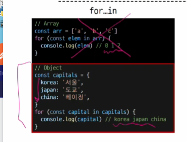
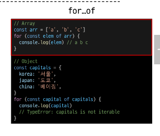

# 2023_10_24

# 변수

# 문법

ECMAScript 2-15 (ES6) 이후의 명제를 따름.
권장 스타일 가이드 : https://standardjs.com/rules-kokr.html

## 식별자(변수명) 작성 규칙 (1/2)

- 반드시 문자, 달러($) 또는 밑줄(\_)로 시작
- 대소구분
- 예약어(for if function 등) 사용 불가
- 카멜 케이스(camelCase)
  - 변수 객체 함수에 사용
- 파스칼 케이스(PascalCase) : 맨 앞도 대문자
  - 클래스, 생성자에 사용
- 대문자 스네이크 케이스 (SNAKE_CASE)
  - 상수(constants)에 사용

## 변수 선언 키워드

- let
- const
- var

### let

- 블록 스코프 (block scope)를 갖는 지역 변수를 선언
- 재할당 가능
- 재선언 불가능
- ES6 에서 추가

```js
let number = 10; // 1.  선언 & 초기값 할당
number = 20; // 2. 재할당
/////////////////////
let number = 10; // 1. 선언 및 초기값 할당
let number = 20; // 2. 재선언 불가능 (같은 이름으로 다시 선언하는 것 불가능)
```

### const

- 블록 스코프를 갖는 지역 변수를 선언
- 재할당 불가
- 재선언 불가
- ES6 에서 추가
- 초기값 필수

```js
const number = 10; // 선언 & 초기값 할당
number = 10; // 불가
```

### 변수 선언 키워드 정리

- 기본적으로 const 사용을 권장
- 재할당이 필요한 변수는 let으로 변경해서 사용

```js
let number = 10;
number = 20;
console.log(number);
let number = 20; //재선언 Uncaught SyntaxError: Identifier 'number' has already been declared (at 01-variables.html:17:9)
const number = 10;
number = 20; // 재할당 -> 다음의 오류
console.log(number); // Uncaught TypeError: Assignment to constant variable.
const number = 20; // 재선언 // Uncaught SyntaxError: Identifier 'number' has already been declared
//
```

## 블록 스코프 (blcok scope)

- if for 함수 등의 '중괄호 {} 내부'를 가리킴
- 블록 스코프를 가지는변수는 블록 바깥에서 접근 불가능
- if for 함수 ( { 다른 계 } ) // 안에서 없으면 전역변수로 찾아 올라가긴 한다. // 반대로 안됨 // python과 같음

```js
// block scope
let x = 1;
if (x === 1) {
  let x = 2;
  console.log(x, "내부"); // 2
}
console.log(x, "외부"); // 1
```

---

<hr>

## 데이터 타입

- 원시 자료형 (Primitive type)
  - Number, String, Boolean, undefined, null
  - 변수에 값이 직접 저장되는 자료형 ( 불변, 값이 복사)
  - 변수에 할당될 때 값이 복사됨
  - 변수간에 서로 영향을 미치지 않음
- 참조 자료형 (Reference type)
  - objects (object, Array, Function) // oop (객체지향이랑 관계 없음)
  - 객체의 주소가 저장되는 자료형(가변, 주소가 복사)
  - 객체를 생성하면 객체의 메모리 주소를 변수에 할당
  - 변수 간에 서로 영향을 미침 // 얕은복-사 당하는 듯?

```js
const bar = "bar";
console.log(bar); //bar
bar.toUpperCase();
console.log(bar); // bar

let a = 10;
let b = a;
b = 20;
console.log(a); // 10
console.log(b); // 20
```

## Number 예시

```js
const a = 13;
const b = -5;
const c = 3.14; // float
const d = 2.99e8; // 2.998 * 10^8 299.800.000
const e = Infinity;
const f = -Infinity;
const g = Nan; // not a  number
```

### string : '+' 연산자를 사용해 문자열 끼리 결함

- 곱셈 나눗셈 뺄셈 불가능

#### Template literals ( f스트링 비슷한것)

- 내장된 표현식을 허용하는 문자열 작성 방식
- Backtick ``을 이용하며, 여러줄에 걸쳐 문자열을 정의할 수도 있고, JavaScript의 변수를 문자열 안에 바로 연결할 수 있음
- 표현식은 $ 와 중괄호 ( ${expression} )로 표기
- ES6+ 지원

```js
const age = 100
cost message = '홍길동은 %{age} 세 입니다.'
console.log(message) // 홍길동은 100세 입니다.
```

### null 과 undefiend (1/2)

#### null

변수의 값이 없음을 의도적으로 표현할 때 사용

#### undefined

변수 선언 이후 직접 값을 할당하지 않으면 자동으로 할당됨

#### 값이 없음에 대한 표현이 null 과 undefined 2개인 이유:

- JavaScript 의 설계 실수
- null 이 원시 자료형 임에도 불구하고 onbject로 출력되는 이유는 JavaScript설계 당시의 버그를 해결하지 않은 것
- 해결하지 못하는 이유는 이미 null 타입에 의존성을 띄고 있는 수 많은 프로그램들이 망가질 수 있기 때문(하위 호환 유지)
- 설계실수 구경하기:

```js
typeof null; // 'object' - 원시 자료형이라면서요
typeof undefined; // ''undefined'' - 이게 정상
```

### Bollean

- true / false
  > 조건문 또는 반복문에서 Boolean이 아닌 데이터 타입은 '자동 형변환 규칙'에 따라 treu 또는 false 로 변환됨 ex) [] == False

| 데이터 타입 | false      | true             |
| ----------- | ---------- | ---------------- |
| undefined   | 항상 false | X                |
| null        | 항상 false | X                |
| Number      | 0,-0, NaN  | 나머지 모든 경우 |
| String      | 빈 문자열  | 나머지 모든 경우 |

## 연산자

### 할당 연산자

- 오른쪽에 있는 피연산자의 평과 결과를 왼쪽 피연산자에 할당하는 연산자
- 단축 연산자 지원

```js
let a = 0;

a += 10;
console.log(a); // 10

a -= 3;
console.log(a); // 7

a *= 10;
console.log(a); // 70

a %= 7;
console.log(a); // 0
```

### 증가 & 감소 연산자

- 증가연산자 ++
  - 피연산자를 증가(1을 더함) 시키고 연산자의 위치에 따라 증가하기 전이나 후의 값을 반환
- 감소 연산자 --
  - 피연산자를 감소(1을 뺌) 시키고 연산자의 위치에 따라 감소하기 전이나 후의 값을 반환

```js
// 전위 연산자
let a = 3;
const b = ++a;
console.log(a, b); //a 4 , b 4

// 후위 연산자
let x = 3;
const y = x++;
console.log(x, y); // x 4 y 3
```

> += 또는 -= 와 같이 더 명시적인 표현으로 작성하는 것을 권장

### 비교 연산자

< > 등 비교 후 bolean 반환

### 동등 연산자

- 두 피연산자가 같은 값으로 평가되는지 비교 후 boolean 값을 반환
- '암묵적 타입 변환' 을 통해 타입을 일치시킨 후 같은 값인지 비교
- 두 피연산자가 모두 객체일 경우 메모리의 같은 객체를 바라보는지 판별

```js
console.log(1 == 1) // true
console.log('hello' == 'hello') // true
console.log('1' = 1 ) // true
console.log(0 == false ) // true
```

### 일치 연산자

- 두 피연산자의 값과 타입이 모두 같은 경우 true 반환
- 같은 객체를 가리키거나, 같은 타입이면서 같은 값인지를 비교
- 엄격한 비교가 이뤄지며 암묵적 타입 변환이 발생하지 않음
- **특수한 경우를** 제외하고는 동등 연산자가 아닌 일치 연산자 사용 권장
  - 특수 경우 : null === undefined // false

```js
console.log(1 === 1); // true
console.log("hello" === "hello"); // true
console.log("1" === 1); // false
console.log(0 === false); // false
```

### 논리 연산자

- and : &&
- or : ||
- not : !
- 단축 평가 (끝까지 볼 필요 없을 때)
  - 1 && 0 // 0
  - 0 && 1 // 0
  - 4 && 7 // 7
  - 1 || 0 // 1
  - 0 || 1 // 1
  - 4 || 7 // 4

## 조건문

**if**

```js
const name = "customer";

if (name === "admin") {
  console.log("1");
} else if (name === "customer") {
  console.log("2");
} else {
  console.log("3");
} // 그리워진다 Python !!!!!!!!
// 스타일 가이드 상 이것을 권장
```

### 조건(삼항) 연산자

- 세 개의 피연산자를 받는 유일한 연산자
- 앞에서부터 조건문, 물음표(?), 조건문이 참일 경우, 실행할 표현식 콜론(:), 조건문이 거짓일 경우 실행할 표현식 배치

```js
const person = 700;
// if (person > 17) {
//   return "yes"
// } else {
//   return "NO"
// }

k = person > 17 ? "yes" : "no";
// 조건 ? 참 : 거짓
console.log(k);
```

## 반복문

### while

- 조건문이 참이면 문장을 계속해서 수행

```js
let i = 0;
while (i < 6) {
  console.log(i);
  i += 1;
}
console.log(i, "while 이후 i 확인"); //

// // 아래는 오류 재할당 X
// const i = 0  // 03-loops-and-iteration.html:24 Uncaught TypeError: Assignment to constant variable.
// while (i < 6 ) {
//   console.log(i)
//   i += 1
// }
```

### for

- 특정한 조건이 거짓으로 판별될 때 가지 반복
  for (초기문; 조건문; 증감문) {
  일해라 핫산
  }

```js
// for
for (let i = 0; i < 6; i++) {
  console.log(i);
}
// 1. 반복문 진입 및 변수 i 선언
// 2. 조건문 평가 후 코드 블럭 실행
// 3. 코드 블록 실행 이후 i 값 증가
```

### for ...in

- 객체(oob 아님, 데이터 타입임)의 열거 가능한 **속성(property)**에 대해 반복
- 배열의 속성은 idx이긴 하나 . . .이거로 인덱스를 끌어오지는 마세요
  for (variable in object) {
  statement
  }

```js
// for ... in  객체에 사용함
// 딕셔너리처럼 생겼지만 js에서는 객체라고 부릅니다.
const fruits = {
  a: "apple",
  b: "banana",
  c: "carrot",
};
// for 내부에서 변수 선언한거라서 필요한 것
for (const property in fruits) {
  console.log(property); // a  b  c 를 for in 으로 불러왔어요
  console.log(fruits[property]);
}
```

### for ...of

- 반복 가능한 객체 (배열, 문자열 등) 에 대해 반복
- iterable !!!!!!
  for (variable of iterable) {
  statement
  }
- js 에서 반복가능한것에 object가 들어가지 않음 //
- js의 iterable 은 문자열, array 정도

```js
// for ... of

const numbers = [0, 1, 2, 3, 4];

for (const number of numbers) {
  console.log(number);
}
// 익숙한 구조네?
```

#### 배열 반복과 for...in (1/2)

- 배열의 인덱스는 정수 이름을 가진 열거 가능한 속성
- for ...in 은 정수가 아닌 이름과 속성을 포함하여 열거 가능한 모든 속성을 반환
- 내부적으로 for ...in 은 배열의 **반복자** 대신 **속성 열거**를 사용하기 때문에 특정 순서에 따라 인덱스를 반환하는 것을 보장할 수 없음 // 잘 보면 for...in을 설명할 때, ''_순서_'' 라는 표현은 없다.
  > 인덱스의 순서가 중요한 배열에서는 사용하지 않는다.
  >
  > **배열에서는 for 반복 혹은 for...of 반복을 사용**

1. object (딕셔너리 사촌, 키 : 밸류)
2. Array 도 설계상 object로 되어있음 그렇게 사용하지 않을 뿐
3.

```js
cosnt arr = ['a', 'b', 'c']
for (const i in arr) {
  console.log(i)
  // 0, 1, 2 // 심지어 인덱스 순서로 나온것도 아님, 그냥 열거된 속성값을 출력했을 뿐이다.
}

for ( const i of arr) {
  console.log(i)
  // a, b, c
}

```

#### for...in (객체전용) 과 for...of(객체 제외 반복 가능한 아이들)





- > for ...of 를 객체에 사용하면 돌아지도 않음
- object는 js에서 iterable 아님

#### 반복문 사용시 const 사용 여부

- for

  - for (let i = 0; i < arr.length; i++) { ...} 의 경우에는 최초 정의한 i를 "재할당" 하면서 사용하기 때문에 const를 사용하면 에러 발생

- for...in / for...of
  - 재할당이 아니라, 매 반복마다 다른 속성 이름이 변수에 지정되는 것이므로 **const를 사용해도 에러가 발생하지 않음**
  - 단, const 특징에 따라 블록 내부에서 변수 수정이 불가능하다. // 재할당이 필요한 경우 let

#### 반복문 종함

|  키워드  |   연관키워드    |   스코프    |
| :------: | :-------------: | :---------: |
|  while   | break, continue | 블록스코프  |
|   for    | break, continue | 블록 스코프 |
| for...in |   object순회    | 블록 스코프 |
| for...of |  Iterable순회   | 블록 스코프 |

- while, for : break, continue 있음 // 동작원리 같음
- for...in for...of 에도 사용 가능
- 중괄호 쓰기 떄문에, 중괄호 찾으면 스코프 구분 가능 (전역,지역변수 느낌)

# 참고

## 세미콜론 (semicolon)

- 자바스크립트는 세미콜론을 선택적으로사용 가능
- 세미콜론이 없으면 ASI 에 의해 자동으로 세미콜론이 삽입됨
  - ASI (Automatic Semicolon Insertion, 자동 세미콜론 삽입 규칙)
- JavaScript를 만든 Brendan Eich 또한 세미콜론 작성을 반대함.
  > Brendan Eich : 쓰지말고 ASI 믿어라.
- ~~난 써봐야지 ㅋ~~

## 변수 선언 키워드 - 'var : 자유분방함

- ES6 이전에 변수 선언에 사용했던 키워드
- 재할당 가능 & 재선언 가능
- [호이스팅](#호이스팅) 되는 특성으로 인해 예기치 못한 문제 발생 가능
- > 따라서 ES6 이후부터는 var 대신 const 와 let 사용 권장
- 함수 스코프(funtion scope)를 가짐 (블록은 {}만 중요함)
  - 함수 내외부만 중요합니다. 블록구분? 그런거 안함
- 변수 선언시 var, const, let 키워드 중 하나를 사용하지 않으면, 자동으로 var로 선언됨
-

## 함수스코프

- 함수의 중괄호 내부를 가리킴
- 함수 스코프를 가지는 변수는 함수 바깥에서 접근 불가능

### 호이스팅

- 변수를 선언 이전에 참조할 수 있는 현상
- 변수 선언 이전의 위치에서 접근 시 _undefined_ 를 반환
- JavaScript에서 *변수*들은 실제 실행시에 코드의 최상단으로 끌어 올려지게 되며(hoisted) 이러한 이유 때문에 var 로 선언된 변수는 선언 시에 undefined 로 값이 초기화 되는 과정이 동시에 발생

```js
1;
console.log(name); // undefined => 선언 이전에 참조
var name = "홍길동"; // 선언

// 위 코드를 암묵적으로 아래와 같이 이해함
var name; // undefined 로 초기화
console.log(name);
var name = "홍길동";

2;
console.log(name); // undefined
var name = "홍길동";

console.log(age); // ReferenceError : Cannot access 'age' befroe initialization
let age = 30;

console.log(height); // ReferenceError : Cannot access 'height' before initialization
const height = 170;
```

### NaN을 반환하는 경우 예시

NaN : Not a Number

1. 숫자로서 읽을 수 없음 (Number(undefined))
2. 결과가 허수인 수학 계산식 (Math.sqrt(-1))
3. 피연산자가 NaN (7\*\*NaN)
4. 정의할 수 없는 계산식 ( 0 \* Infinity)
5. 문자열을 포함하면서 덧셈이 아닌 계산식 ('가' / 3 )

# JS Is Weird - 사이트임 // 문제 있 음 함 해보세요
