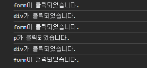
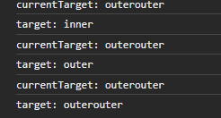
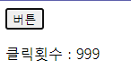
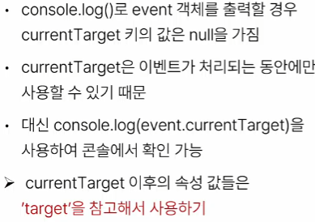

# 2023_10_26

# **event**
일상:
- 손 흔들어 인사하기 
- 전화기 버튼 눌러서 뭔가 뭔가 하기

웹 :
- 버튼 클릭 팝업
- 마우스 커서 위치에 따라 드래그 앤 드롭
- 키보드 입력 값에 따라 새로운 요소를 생성하는 것
> 이벤트를 통해 특정 동작을 수행

# *JavaScript* **Event**

# Event object
DOM 에서 이벤트가 발생했을 때 생성되는 객체
- mouse, input,m keyboard, touch, ..., etc.
- 와 MDN!
*DOM 요소는 event를 받고 받은 event를 `처리` 할 수 있음*
- event handler : 이벤트 처리기

## .addEventListener()
대표적인 이벤트 핸들러 中 1
> 특정 이벤트를 DOM 요소가 수신할 때마다 콜백 함수를 호출
- 콜백함수 ej ) foreach 이후 . . .

EventTarget.addEventListner(type, handler)
- EventTarget : DOM 요소
- type : 수신할 이벤트
- handler : 콜백함수 (동작)

대상(EventTarget)에 특정 event(type)가 발생하면, 지정한 이벤트를 받아 할 일(handler)을 등록한다.

### type
- 수신할 이벤트 이름
- 문자열로 작성 (ej. click)

### handler 
- 발생한 이벤트 객체를 수신하는 콜백 함수
- 콜백 함수는 발생한 Event object를 유일한 매개변수로 받음

### [addEventListener 활용](./lo_que_hecho.md/#addeventlistener-활용)
- 버튼 클릭 -> 버튼 요소 출력

### addEventListner의 콜백함수 특징
- 발생한 이벤트를 나타내는 Eent 객체를 유일한 매개변수로 받음
-  **아무것도 반환 안함**

## 버블링
- 핸들러는 form 요소에 할당되어 있지만 div나 p같은 중첩된 요소를 클릭해도 동작함 (하위 요소를 클릭하면 상위 이벤트도 동작한다.)
- 버블링 : 버블소트 : 헉! 거품 : 위로 올라감!!
- 

- 한 요소에 이벤트가 발생하면, 이 요소에 할당된 핸들러가 동작하고 이어서 부모 요소의 핸들러가 동작하는 현상
- 가장 최상단의 조상 요소(document)를 만날 떄까지 반복되며 요소 각각에 할당된 핸들러가 동작
-  > 이벤트가 제일 깊은 곳에 있는 요소에서 시작해 부모 요소를 거슬러 올라가며 발생하는 것이 마치 물속 거품과 닮았기 때문

이벤트가 정확히 어디서 발생했는지 알아내는 방법

## target & currentTarget

: currentTarget :  이벤트 리스너가 부착된 자리(이미지 : 버블링 일어났음)
: target : 실제 이벤트가 발생한 위치 

### target
- 이벤트가 발생한 가장 안쪽의 요소(target)를 참조하는 속성
- 실제 이벤트가 시작된 target 요소
- 버블링이 진행 되어도 변하지 않음
### currentTarget
- '현재' 요소
- 항상 이벤트 핸들러가 연결된 요소를 참조하는 속성
- 'this'와 같음 (= event.currentTarget)

> 버~블~링~ 왜~ 일어날~ 까~ 브~라~우저~의 입~장에서~생각~해보자~
>
>  브라우저 -> 캡처링 (타겟까지 찾아 가는 과정)
>
> 브라우저는 어딘지~몰라요~ 그래서
> 
> 이벤트 핸들러를 찾~아보~자
>
> 타겟 도착 : 리스너 찾았~다
>
> 찾아서 들고 올라감 - 버블링

[버블링 장점  (예시)](/lo_que_hecho.md/#버블링-장점)

### event handler 활용

#### 1. 버튼을 클릭하면 숫자를 1씩 증가해서 출력하기

#### [2. 사용자의 입력 값을 실시간으로 출력하기](/lo_que_hecho.md/#2사용자의-입력-값을-실시간으로-출력하기)
  
#### 3. 사용자의 입력 값을 실시간으로 출력, '+' 버튼을 클릭하면 출력한 값의 CSS 스타일 변경
#### 4.[todo 프로그램 구현 ](/lo_que_hecho.md/#4-todo)
#### 5. 로또 번호 생성기 구현
- JS는.. 난수도.. range 생성도... sample도.. 없..다...

### currentTarget 주의사항

lodash 어어어어어억

## 이벤트 기본 동작 취소
.preventDefault()
- a태그 같은거 아무것도 못하게 하기
- 해당 이벤트에 대한 *기본 동작*을 **실행하지 않도록**지정
- 9번 파일 : 복사 할 수 없습니다.

addEventListener 화살표 함 수 쓰지 말 아 라!!!!!!!!!
