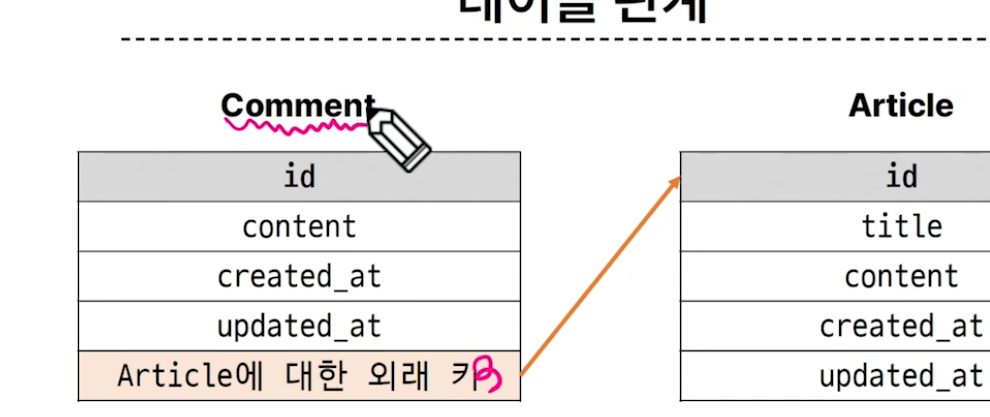
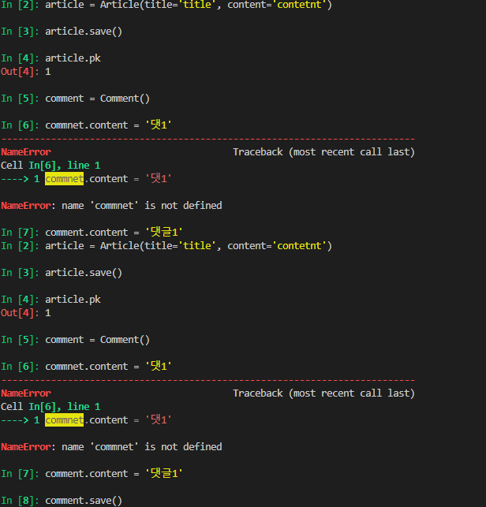
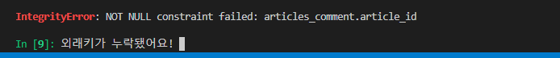
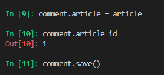
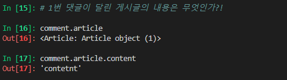
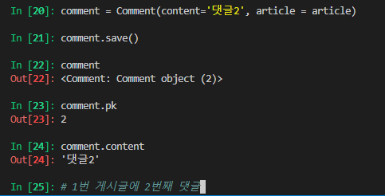
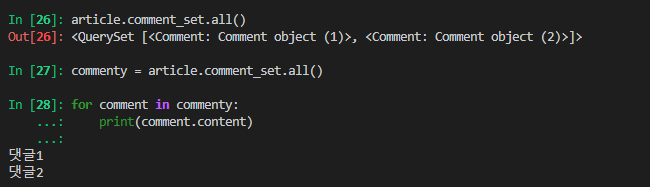
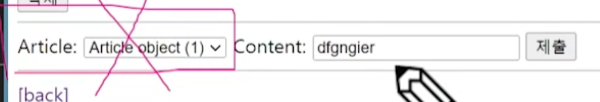
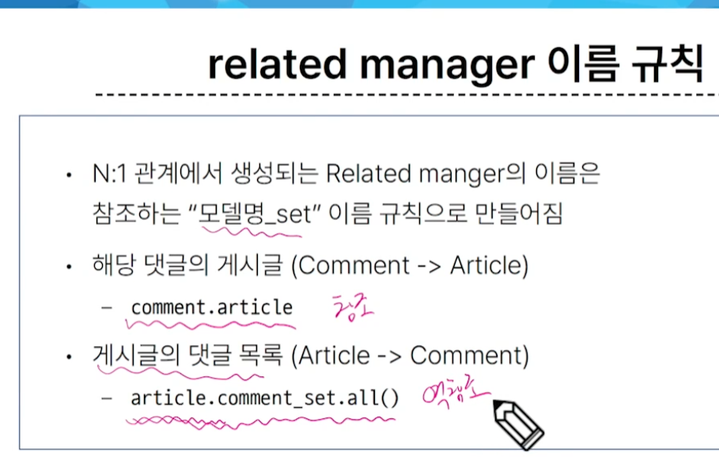
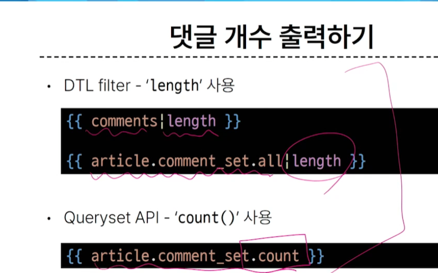

# 2023_10_15 * 원래는 수요일

##   Many to one relationships
한 테이블의 0개 이상의 레코드가 다른 테이블의 레코드 한 개와 관련된 관계


ex: Comment - Article
- 0개 이상의 댓글은 1개의 게시글에 작성 될 수 있다.

테이블 관계 - 외래 키로 관계를 잡아줌.



comment 가 article에 대한 외래키가 필요하다.  
N쪽이 외래키를 가지고 있다.

### ForeignKey()
- N : 1 관계 설정 모델 필드
- 인자 두개 받음
- models.ForeignKey(Article, on_delete=models.CASCADE)
  - Article 외래키
  - 데이터 무결성 위해 on_delete... 있음 
  - models.CASCADE : 부모 객체가 삭제되었을 때 이를 참조하는 객체도 삭제


다만 앱의 목적은 기능 단위로 나눈다!  
account : 유저, 인증과 관련된 것  
Article : 게시글과 관련된 앱 - > 이곳의 models.py가 적정하지 않을까?

##  1 > N
 - 댓글이 어떤 게시글에 작성되었는지를 조회 가능
## N > 1
 - 게시글에 작성된 모든 댓글을 조회 


# 한 일
1. article - models.py 
   1. class comment 작성 
      1. article (상속 받자)
      2. content (댓글 내용)
      3. 작성시간 etc

2. shellplus에서 연습할겁니다?
   1. 이미지
   
   

   <hr>

   

   아무튼 수정했습니다.
     

   <br>

   참조 방법
    article = models.ForeignKey(Article, on_delete=models.CASCADE) 
    이거 덕분에 편하게 게시글 내용 참조해옴!

    

    1번 댓글이 달린 게시글의 번호는 무엇?

    ```py
    comment.article.pk
    comment.article_id
    # 결과는 같다.
    ```
    두번째 댓글 shell_plus 에서 만들었습니다.

    

    인스턴스의 정보만 조회한 것이엇읍니다.

    comment = Comment(content='댓글2', article = article)

    이건 db 접근이 맞고요

    지금 이대로라면 Article은 Comment의 존재 자체를 몰라요

    역참조가 필요할지도. << Django 도와줘!>>

3. 역참조
   
  

4. 댓글 CREATE 구현  // commentform은 detail에서 출력될 것
   
   1. 'Articles\forms.py' 
      1. import Comment
      2. CommentForm 정의

   2. 'Articles \ views.py'
      1. detalil 함수에 comment_from 추가
   3. 'detail.html'
    ```html
      <form action ="#" method="POST">
        
        {{comment_form}}
        </form>
      ```
      댓글 작성  form 추가 지만 이대로면 
      
      이런 모양이 나옵니다. 따라서 수정이 필요.  (( 뒤의 Content만 출력하도록 해야 함))

    4. forms.py 에서 fields를 content, 수정
      - 외래 키 필드는 사용자 입력 값으로 받는 것이 아닌 view 함수에서 처리되어야 함
      - 1번 게시글 정보 : 1번 pk 에 있잖아요.
    5. 필요한 것은 Article의 Pk. url로 가세요  // urls.py   
      ```py
      path('<int:pk>/comments/', views.comments_create, name='comments_create'),
      # article을 조회하기 위한 pk임.
      ```
    6. views.py
       1. comments_create(req, pk)
    ```py
        def comments_create(request, pk): # 이곳에는 항상 POST 요청만 들어온다. get post 나눌 이유 없음.
    # 게시글 조회
    article = Article.objects.get(pk=pk)
    # CommentForm으로 사용자로 부터 데이터를 입력받음
    comment_form = CommentForm(request.POST)
    if comment_form.is_valid():
        comment_form.save()
        return redirect('articles:detail', article.pk)

    context= {
        'comment_form': comment_form,
    }
    return render(request, 'articles/detail.html', context)
    ```

    7. html  재수정
     ```html
      <form action="" method="POST">
      
      {{ comment_form }}
      <input type="submit">
    </form>

      ```  
    8. 아직 외래키 안들어갔습니다.
        - 아름답게 수정합시다
      

       ```py
           if comment_form.is_valid():
        comment = comment_form.save(commit=False) # 저장은 아직 하지 않으나, 인스턴스는 제공해줌!
        comment.article = article # 해당 게시글에 묶어준 것 같아요
        comment_form.save() # 진짜 저장
        return redirect('articles:detail', article.pk)
       ```

5. 댓글 READ
   1. detail view 함수에서 전체 댓글 데이터 조회 (역참조)
      1. 역참조!?!?!!? 
        ```py
          comment_form = CommentForm()
          # 특정 게시글의 모든 댓글을 조회(역참조)
          comments = article.comment_set.all() # 해당 article 인스턴스의 댓글만 조회할 것임
          # comments = Comment.objects.all() # 이러지 마세요. '모든' 댓글임
          context = {
              'article': article,
              'comment_form': comment_form,
              'comments': comments,
          }

        ```
   2. html 
      1. views.py 에서 넘어온 것으로 잘 받아봅시다.
      2. for 이용
      ```html
        <h4>댓글 목록</h4>
        <ul>
          
            <li>
              {{ comment.content }}
            </li>
          
        </ul>
      ```
    3. 아직 작성자와는 연관이 없습니다.
<hr>

 6. 댓글 DELETE
    1. 삭제를 위한 url 작성  + view 함수

      > view
    ```py
          @login_required
      def comments_delete(request, comment_pk):
          comment = Comment.objects.get(pk=comment_pk)
          article_pk = comment.article.pk # comment를 이용하여 article의 pk를 알아내자
          comment.delete()
          return redirect('articles:detail', )
          # articles 에 redirect 하기 위해서는 필요하다 article의 pk 
          # 교재랑 다르긴 하지만 되는구나!
          # url에서 pk를 가져올 수 있다면 설계 측면에서 권장된다.
          # 통일성이 조금 떨어질 뿐 다시 갑니닷.
          # url 수정하고 오겠습니다.****
    
    ```
     > url

    ```py
    path(
      '<int:article_pk>/comments/delete/',views.comments_delete, name='comments_delete'
    )
    ```
    2. views.py gogo // import comment
    3. detail.html 버튼 만들기
      ```html
        <h4>댓글 목록</h4>
        <ul>
          
            <li>
              {{ comment.content }}
              <!--  삭제 버튼임  -->
              <form action="" method="POST">
                
                <input type="submit" value="삭제">
                <!-- 삭제 버튼임  css 잘 비벼서 알아서 올리세요 ㅋ -->
              </form>
            </li>
          
        </ul>
      ```
    4. url 설계 구조 통일성 위한 수정
     ```py
      path (
          '<int:article_pk>/comments/<int:comment_pk>/delete/',
          views.comments_delete,
          name='comments_delete',
      )
     ```
    view 도 바꿔줘야겠죠


### 역참조 : 
N : 1 관계에서 1 에서 N을 참조하거나 조회하는 것
> N 은 외래 키를 가지고 있어 물리적으로 참조가 가능하지만, 1은 N에 대한 참조 방법이 존재하지 않아 별도의 역참조 이름이 필요하다  
예시 :  

article.comment_set.all()
모델 인스턴스 . related manager(역참조 이름). QuerySet API  
related manager 
- N : 1 혹은 M: N 관계에서 역참조 시에 사용하는 매니저
- objects 매니저를 통해 queryset api를 사용한 것 처럼 
- related manager를 통해 queryset api를 사용할 수 있게 해 줌 



실습이 필요해보입니다

[과정](#한-일)


### save(commit = False)
DB에 저장하지 않고 인스턴스만 반환  
commit : DB에 한줄씩 입력하는 것에서 유래?

### DTL 'for empty tag' 
비어있을 때 따로 예외 사항

dtl filter length // 댓글 개수 출력



# 댓글 수정 : 
게시글 수정 . . . .   
하지만 댓글 수정은 이동 안하고 그 자리에서 합니다.  
페이지 유지 + 일부분만 변경 될 때 == JS

아직 하지 말아요~ 