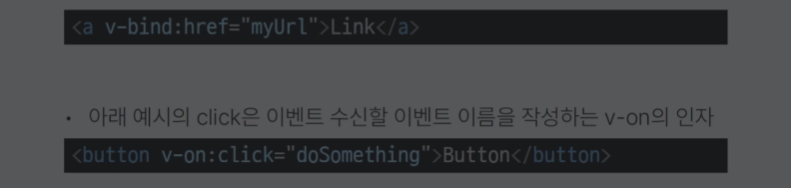
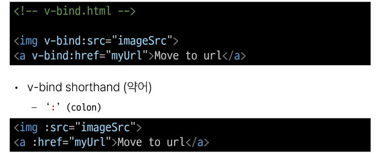

# 2023_11_02 Vue Basic Syntax

1. Text Interpolation
2. Raw HTML
3. Attribute bindings
4. Javascript Expressions

## Text interpolatio
- 데이터 바인딩의 가장 기본적인 형태
- 이중 중괄호 구문(콧수염 구문)을 사용
- 콧수염 구문은 해당 구성 요소 인스턴스의 msg 속성값으로 대체
-  msg 속성이 변경될 떄마다 업데이트 됨
  
## Raw HTML
- 콧수염 구문을 데이터를 일반 텍스트로 해석하기 때문에 실제 HTML을 출력하려면 v-html을 사용해야 함 

## Attribute Bindings
-  콧수염 구문은HTML속성 내에서 사용할 수 없기 때문에 V-bind를 사용
-  HTML의 id 속성 값을 vue 의 dynamicId 속성과 동기화 되도록 함바인딩 값이 nul이나 undefind인 경우 렌더링 요소에서 제거됨
-  요소 연결

## JavaScript Exressions 
- Vue 는 모든 데이터 바인딩 내에서 JavaScript 표현식의 모든 기능을 지원
- Vue  템플릿에서 JavaScript 표현식을 사용할 수 있는 위치
  -  콧수염 구문 내문
  -  모든 directive의 속성 값 (v-로 시작하는 특수 속성)

위에서 뭔가 뭔가 가능하지만 
```html
{{ msg.split('').reverse().join('')}}  이런건 <script> 내부에서 해서돌려주자 . 
```

## Expressions 주의사항 
- 각 바인딩에는 하나의 단일 표현식만 포함될 수 있음
  - 표현식은 값으로 평가할 수 있는 코드조각(return뒤에 사용할수있는 코드여야 함 )

# Directive
`v-' 접두사가 있는 특수 속성

## Directive의 특징 
- Directive의 속성 값은 단일 JavaScript 표현식어야 함 (단 ,v-for, v-on 제외)
- 표현식 값이 변경될 때 DOM에 반응적으로 업데이트를 적용

- 예시
  -  v-if 는 seen 표현식 값의 T/F 를 기반으로 ```<p> ```요소를 제거 삽입
```html
<p v-if="seen">Hello</p>
```

## Directive 전체 구문 
v-on:submit.prevent="onSubmit"
- text_ex : description 
- v-on : name - starts with v- may be omitted when using shorthands
- submit : Argument - Follows the colon or sorthand symbol
- prevent : Modifiers - Denoted by the leading dot
- "onSubmit" : Value - interpreted as JaavaScript exressions

## Directive - Arguments
- 일부 directive  는 directive 뒤에 콜론 (:)으로 표시되는 인자를 사용할 수 있음
- 아래 예시의 href는 HTML a 요소의 href 속성 값을 myUrl값에 바인딩하도록 하는 v-bind의 인자
- 아래 예시의 click은 이벤트 수신할 이벤트 이름을 작성하는 v-on의 인자
- 

## Directive - Modifiers 
- .(dot)로 표시되는 특수 접미사로, directive가 특별한 방식으로 바인딩되어야함을 나타냄
- 예를 들어 .prevent는 발생한 이벤트에서 event:preventDefault()를 호출하도록 v-on에 지시하는 modifier. `chaining 가능하다`

## Built-in-Directive
공식문서 구경

# Dynamically data binding

## v-bind 
- 하나 이상의 속성 또는 컴포넌트 데이터를 표현식에 동적으로 바인딩
### 사용처
1. Attribute Bindings
2. Class and Style Bindings

### Attribute Bindings
2번파일
- HTML의 속성 값을 Vue의 상태 속성 값과 동기화 되도록 함

- v-bind shorthand
- 


- Dynamic attribute name (동적 인자 이름)
  - 대괄호로 감싸서 directive argument에 JavaScript 표현식을 사용할 수도 있음
  - JavaScript 표현식에 따라 


## Class and style Bindings
- 클래스와 스타일은 모두 속성이므로 v-bind를 사용여 다른 속성과 마찬가지로 동적으로 문자열 값을 할당할 수 있음
- 그러나 단순히 문자열 연결을 사용하여 이러한 값을 생성하는 것은 번거롭고 오류가 발생하기가 쉬움
- Vue는 클래스 및 스타일과 함께 v-bind를 사용할 때 객체 또는 배열을 활용한 개선 사항을 제공
### Class and Style Bindings가 가능한 경우
1. Binding HTML Classes
   1. Binding to Objects
   2. Binding to Arrays
2. Binding Inline Styles
   1. Binding to Objects
   2. Binding to Arrays
### 1.1 Binding HTML Classes - Binding to objects
객체 넣기 // boolean
- 반드시 inline 방식으로 작성하지 않아도 됨
- 배열 구문 내에서 객체 구문 사용 ( { '클래스명' : '조건'} 으로 추정됨)

### 1.2  Binding HTML Classes - Binding to Arrays
- :class 를 배열에 바인딩하여 클래스 목록을 적용할 수 있음
- 배열 구문 내에서 객체 구문 사용  ( { '클래스명' : '조건'} 으로 추정됨)
### 2.1 Binding Inline Styles - Binding to Object
속성과 속성 값 가능 / boolean 아님

- 실제 CSS에서 사용하는 것 처럼 :sytle은 
- 템플릿을 더 깔끔하게 작성하려면 스타일 객체에 직접 바인딩하는 것을 권장

### 2.2 Binding Inline Styles - Binding to Arrays
ㅁㄴㅇㄹ
## v-bind 종합
ㅁㄴㅇㄹ
## V-on ( 수식어가 많아요 )
ㅁㄴㅇㄹ
[키보드 이벤트 수식어](https://developer.mozilla.org/ko/docs/Web/API/KeyboardEvent)

## v-on 이벤트 리스너 다룸 
ㅁㄴㅇㄹ
## Form Input Bindings 
- form을 처리할 때 사용자가  input에 입력하는 것을 실시간으로 JavaScript 상태에 동기화해야하는 경우
- ㅁㄴㅇㄹ

### v-bind와 v-on 함께 사용
6번파일
### v-model // 한국어 혐오자 ( IME가 필요한 언어 ;;)
ㅁㄴㅇㄹ
### v-model 사용자 입력 양방향
1. Checkbox 활용
ㅁㄴㅇㄹ