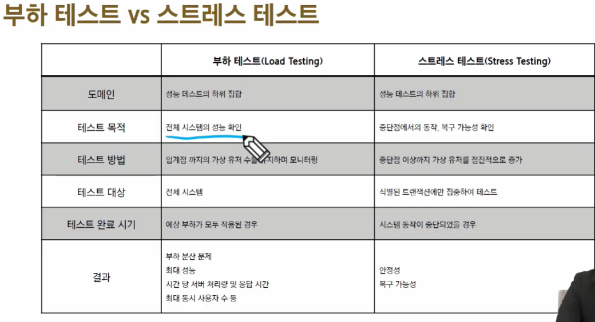

# 2023_11_03 PJT 

# Django에서 알고리즘 구현 및 성능 분석

1. 테스트란? 
   1. 원하는 기능이 모두 구현되었는지 확인하고, 숨겨져 있는 결함을 찾는 활동
   2. 여러가지 도구들을 활용하여 버그를 찾아내고 신뢰성 보안 성능 등을 검증하는 중요한 단계 
-  상황에 맞게 필요한 테스트를 진행해야 한다.
   -  외우지 말고 검색을 통해 필요한 것만 찾아서 쓰자? 

## 성능테스트 
- 핵심적인 테스트 중 하나 . . . 
  - 소프트웨어 테스팅 ( IEEE 29119 ? )  : 상식적으로만 알아두자 
- 목적 
  - 여러 테스트를 통해 성능 저하가 발생하는 요인을 발견하고 제거 
  - 시장에 출시되기 전에 발생할 수 있는 위험과 개선사항을 파악
  - 안정적이고 신뢰할 수 있는 제품을 빠르게 만들기 위함

## 부하테스트
- 시스템에 임계점의 부하가 계속될 때 문제가 없는가?
- 목적 : 시스템의 신뢰도와 성능을 측정
- 임계점 : 사용자 혹은 요청이 점점 늘어나다가 응답시간이 급격히 느려지는 시점
## 스트레스 테스트 
- 시스템에 과부하가 오면 어떻게 동작할까 
- 목적 : 장애 조치와 복구 절차가 효과적이고 효율적인지 확인 

## Locust 
- 오픈소스 부 하테스트 도구
- 번역 : 메뚜기, 메뚜기 떼가 웹 사이트 공격한다는 의미
- 내가 만든 서버에 수많은 사용자들이 동시에 들어올 때 어떤 일이 벌어지는 지를 확인하는 부하 테스트를 할 수 있는 도구 
- Locust를 선택한 이유 
  - 파이썬 언어로 테스트 시나리오 간편하게 작성 가능
  - 결과를 웹에서 확인할 수 있는 UI 를 지원

### 통계 : 
- 50% : 암튼 암튼
- 90% : 대략적 나머지 
- 95% : 어...
- 99% : 예외사항
- 변태들. . . 