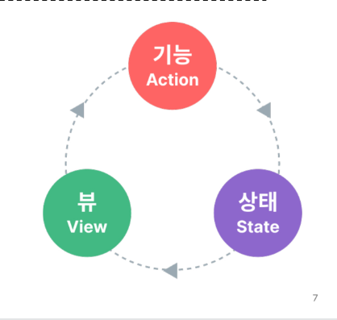

# 2023_11_13

# State Management 상태 관리

Vue 컴포넌트는 이미 반응형 상태를 관리하고 있음

> 상태 === 데이터

# 컴포넌트 구조의 단순화

- 상태 State
  - 앱 구동에 필요한 기본 데이터
- 뷰 View
  - 상태를 선언적으로 매핑하여 시각화
- 기능 Actions
  - 뷰에서 사용자 입력에 대해 반응적으로 상태를 변경할 수 있게 정의된 동작
    > 단방향 데이터 흐름의 표현
    > 

## 상태 관리의 단순성이 무너지는 시점

- 여러 컴포넌트가 상태를 공유할 때
  1. 여러 뷰가 동일한 상태에 종속되는 경우
  - 공유 상태를 공통 조상 컴포넌트로 끌어올린 다음 props 로 전달하는 것
  - 계층구조가 깊어질 경우 비효율정, 관리가 어려워짐
  2. 서로 다른 뷰의 기능이 동일한 상태를 변경시켜야 하는 경우
  - 발신(emit)된 이벤트를 통해 상태의 여러 복사본을 변경 및 동기화 하는 것
  - 마찬가지로 관리의 패턴이 깨지기 쉽고 유지 관리할 수 없는 코드가 됨

## 해결책

- 각 컴포넌트의 공유 상태를 추출하여, 전역에서 참조할 수 있는 저장소에서 관리
- 컴포넌트 트리는 하나의 큰 '뷰'가 되고 모든 컴포넌트는 트리 계층 구조에 관계없이 상태에 접근하거나 기능을 사용할 수 있음
- Vue 의 공식 상태 관리 라이브러리 === 'Pinia'

# State management library (Pinia)

## Pinia

> Vue 공식 상태 관리 라이브러리

pjt-pinia :
초기 값으로 상태, 기능 들이 저장되어 있읍니다

## Pinia 구성 요소

1. store
   - 중앙 저장소
   - 모든 컴포넌트가 공유하는 상태, 기능 등이 작성됨
2. state
   - 반응형 상태(데이터)
   - ref() === state
3. getters
   - 계산된 값
   - computed() === getters
4. actions
   - 메서드
   - function() === actions
5. plugin
   - 애플리케이션의 상태 관리에 필요한 추가 가능을 제공하거나 확장하는 도구나 모듈
   - 애플리케이션의 상태 관리를 더욱 간편하고 유연하게 만들어주며, 패키지 매니저로 설치 이후 별도 설정을 통해 추가 됨

```js
// store
import { ref, computed } from "vue";
import { defineStore } from "pinia";

export const useCounterStore = defineStore("counter", () => {
  // state
  const count = ref(0);
  // getters
  const doubleCount = computed(() => count.value * 2);
  // actions
  function increment() {
    count.value++;
  }

  return { count, doubleCount, increment };
});
```

6. Pinia 구성 요소 종합
   - pinia는 store라는 저장소를 가짐
   - store는 state, getters, actions 로 이루어지며
   - 각각 ref(), computed(), function() 과 동일하다.

## Pinia 자세히

### state

- store 인스턴스로 state에 접근하여 직접 읽고 쓸 수 있음
- 만약 store에 state를 정의하지 않았다면 컴포넌트에서 새로 추가할 수 없음

### Getters

- store의 모든 getters 를 state 처럼 직접 접근 할 수 있음

### Actions 
- store의 모든 actions를 직접 접근 및 호출 할 수 있음
- getters 와 달리 state 조작, 비동기, API 호출이나 다른 로직을 진행할 수 있음

# Pinia를 활용한 Todo 프로젝트 구현
- Todo CRUD
- Todo 개수 계산 
  - 전체 Todo //||
  - 완료된 Todo //|| 
  - 미완료된 Todo //|| 


### 최대한 기능적 단위로 component를 구성하라.


# pinia-plugin-persistedstate
- Pinia의 ... ㅁㄴㅇㄹ