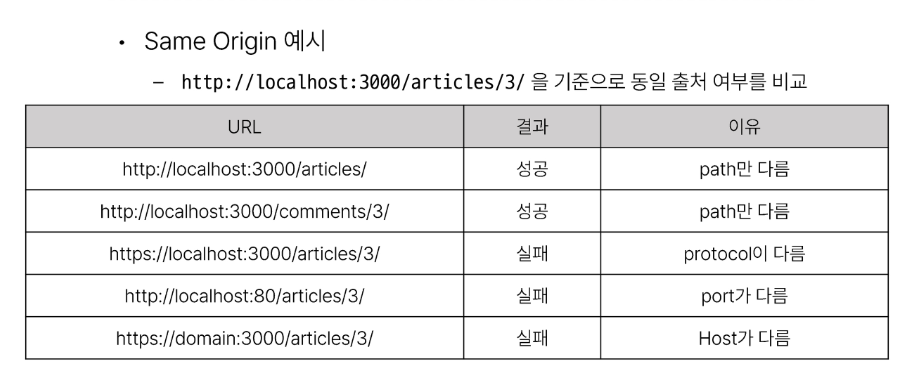

# 2023_11_14

# DRF 는 주석을 해제하며 진행

#  MD 쓸 시간 있을까 . . 


```
python manage.py makemigrations
python manage.py migrate
python manage.py loaddata articles.json  
python manage.py runserver
http://127.0.0.1:8000/api/v1/articles/
```


많은 코드들이 주석처리 - 해제하는 방식의 학습

잘 따라가자. 

# Vue 
# 학습 진행과정


## 시작하기 전에 . . .
- 무결점의 프로젝트를 만드는 것이 아니다.
- front-end 프레임워크와 back-end 프레임워크간의 요청과 응답, 그 과정에서 등장하는 새로운 개념과 문제를 해결하며 하나의 웹 애플리케이션 서비스를 구현하는 과정에 집중해야 한다.


Vue -> Django : 브라우저 측에서 거절됨
> CORS policy 에 의해 차단됨
>

## SOP (Same-origin Policy)
: 동일 출처 정책
- 어떤 출처(Origin)에서 불러온 문서나 스크립트가 다른 출처에서 가져온 리소스와 상호 작용 하는 것을 제한하는 보안 방식
- > 웹 애플리케이션의 도메인이 다른 도메인의 리소스에 접근하는 것을 제어하여 사용자의 개인 정보와 데이터의 보안을 보호하고, 잠재적인 보안 위협을 방지
- > 잠재적으로 해로울 수 있는 문서를 분리함으로써 공격받을 수 있는 경로를 줄임

### Origin 
- URL의 Protocol, Host, Port 를 모두 포함하여 출처라고 부름 
- Same Origin 예시 
  - 아래 세 영역이 일치하는 경우에만 동일 출처(Same-origin)로 인정
  
 



## CORS policy의 등장 
- 기본적으로 웹 브라우저는 같은 출처에서만 요청하는 것을 허용하며, 다른 출처로의 요청은 보안상의 이유로 차단됨
  - SOP에 의해 다른 출처의 리소스와 상호작용 하는 것이 기본적으로 제한되기 때문
- 하지만 현대 웹 애플리케이션은 다양한 출처로부터 리소스를 요청하는 경우가 많기 때문에 CORS 정책이 필요하게 되었음 
- > **CORS**는 웹 서버가 리소스에 대한 서로 다른 출처 간 접근을 허용하도록 선택할 수 있는 기능을 제공

## CORS (교차 출처 리소스 공유)
- 특정 출처(Origin)에서 실행 중인 웹 애플리케이션이 **다른 출처의 자원에 접근할 수 있는 권한을 부여**하도록 브라우저에 알려주는 체제 
  - 만약 다른 출처의 리소스를 가져오기 위해서는 이를 제공하는 서버가 브라우저에게 다른 출처지만 접근해도 된다는 사실을 알려야 함 
  - "CORS policy" : 교차 출처 리소스 공유 정책


- 다른 출처에서 온 리소스를 공유하는 것에 대한 정책
- 서버에서 설정되며, 브라우저가 해당 정책을 확인하여 요청이 허용되는지 여부를 결정
- 다른 출처의 리소스를 불러오려면 그 출처에서 올바른 **CORS header**를 포함한 응답을 반환해야 함.

## CORS Headers 설정하기 
- Django에서는 django-cors-headers 라이브러리를 활용
- > 손쉽게 응답 객체에 CORS header를 추가해주는 라이브러리

