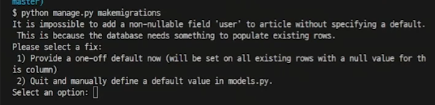
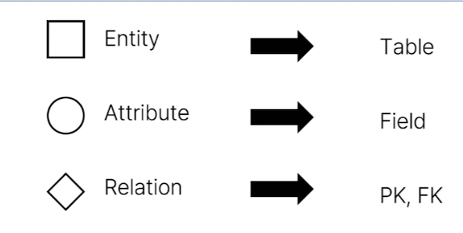
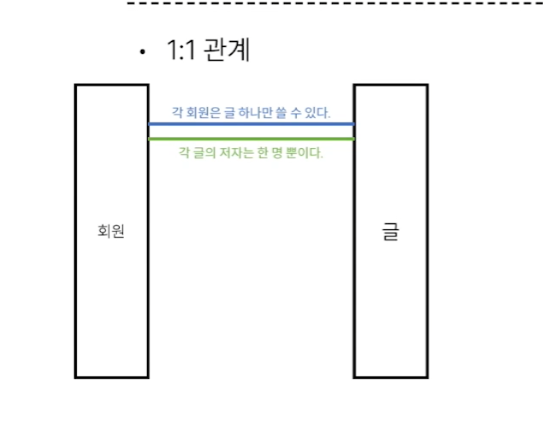
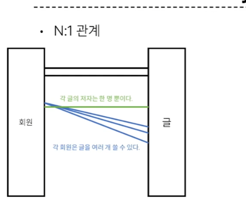
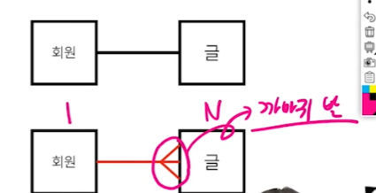
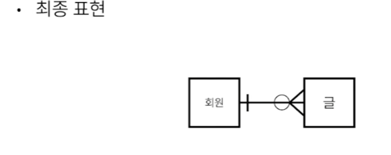

# 23_10_12

# A= 1 C = N
외래키는 N이 가진다.  

1 쪽에서 N 을 참조할 때, N에 대한 정보가 없다.
> related manager. (ModelNmame_set)
> 이번 강의에서는 작성자 User 에 대한 Model 그리고 다른 Article, Commentr가 연결 될 예정


## Article(N) - User(1)
0 개 이상의 게시글은 1명의 회원에 의해 작성 될 수 있다.
> 외래키는 Article에 추가됨(User의 PK를 가진다.)

## Comment(N) - User(1)
0 개 이상의 댓글은 1명의 회원에 의해 작성 될 수 있다.
> 외래키는 Comment에 추가됨 


# Article & User

참조하는 모델에 "소문자 단수" : 실제로 테이블로 되면 이 아래에 _id 이렇게 만들어지니까 (user_id로 만들면 -> user_id_id 로 만들어진다.)

models.Foreignkey(참조대상, on_delete=models.CASCADE 앞놈 사라지면 삭제됨)

model에서 user 같은 것 참조할 땐 :  
```py
### 하지마세요
from .models import User
# 장고는 유저모델에 대한 직접 참조를 싫어함.
# 유저 모델이 만약에 여러개라면?
# 변동사항이 생겼을 때 하나씩 바꿀 것임???
# 현재 유저 모델을 반환하는 함수들을 주로 이용한다.


###

from django.conf import settings
user = models.ForeignKey(settings.AUTH_USER_MODEL, on_delete=models.CASCADE)
# model_form  - 
# get_user_model - 활성화 된 유저모델 / 여기서 사용했을 때 결과는 같지만, models.py 의 경우 settings.AUTH_USER_MODEL 씀
```
**핵심** :   
1. get_user_model 
   - 유저 객체
   - 위치 : models.py 가 아닌 다른 모든 위치
2. settings.AUTH_USER_MODEL
   - 문자열 참조
   - 위치 : models.py

> 이유 : models.py 가 구동이 되는 순간에, User라는 객체가 Django에 없을수도 있기 때문.
> *models.py*의 구동 순서가 빠르기 때문. 따라서 문자열로 이런 문제를 사전에 방지함 
> 직접참조로 하면 이전 버전은 문제가 있긴 했음 . . . 권장하지는 않음 심지어 나중에 앱 커지다보면, 의존성 증가 == 문제 발생 확률 증가
> 아무튼 에러 방지를 위한 문자열 입력! ! !




Django : 님 뭐 넣을거임? // 외래키도 뭔가 뭔가 아무튼 기본값이 필요한걸? : DB에 NULL No.

-> ForeignKey default 뭐 넣을것임? : 만약 게시글이 있었다면, 임의로 부여해줘야 함  
: 단 아무것도 없을 때. . . . - 기존에 게시글이 있다면, 여기에 뭔가 임의의 정수에 해당하는 id가 기존의 모든 게시글의 작성자가 됨


Create form 수정: User (작성자) 안나오게

그래서 class 수정하는겁니다.
exclude user.  + views.py 수정

import 서순
- django 
- 로컬( models ,etc, )
- import 정렬 패키지
-  isort
- -m pip install "isort >= 5.1.0"
- isort .
- 
로컬 import


## ERD - Data Modeling
데이터베이스 시스템을 시각적으로 표현하는 프로세스 
> 데이터 유형, 데이터 간의 관계 및 분석 등을 통해 비즈니스 요구사항을 만들어 낼 수 있도록 도움

### ERD - (Entity-Relationship Diagram)




#### Cardinality (기수)
- 1:1 관계 
- 

- N:1 관계





까마귀 발 : N 임

#### Optionality (선택가능성)
1 = 필수 
0 = 옵션


- 각각의 회원은 0개 이상의 글을 가진다.


ERD : 글로 설명 안함. 명세에 들어가야 함. 그림으로 무슨 필드, 내용을 알수 있다. 여러가지 방법이 있다. 아무튼 그렇다.

### Cardinality + Optionality 의 조합 :
- 하나의 회원은 여러개의 글을 작성할 수 있고, 하나의 글은 한 명의 회원이 작성할 수 있다
- 글과 회원의 관계는 N:1 이며, 글은 필수적으로 회원과 연결되어야 하지만, 회원은 선택적으로 글과 연결될 수 있는 관계다.  

#### ERD 사이트 (무료)
1. app.diagrams.net
2. erdcloud.com

## 데이터 모델링의 중요성
- DB SW 개발 오류 감소 
- DB 설계 및 생성 속도와 효율성 촉진
- 조직 전체에서 데이터 문서화 및 시스템 설계의 일관성 조성
- 데이터 엔지니어와 비즈니스 팀간의 커뮤니케이션 촉진

