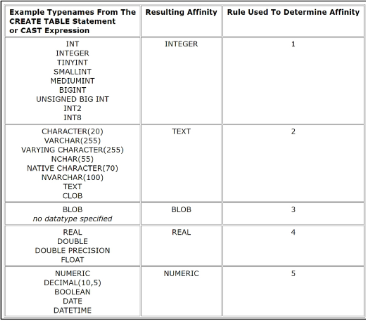

# 예비군으로 인하여 늦게 함.

# 2023_10_14


## Database

체계적인 데이터 모음 <br>
+ 데이터 저장 / 조작

역할 : (구조적)저장하고 조작. CRUD


### Relational Database
관계형 데이터 베이스  
데이터간 관계가 있...

- 테이블, 행 열 정보 구조화
- **서로 관련된** 데이터 포인터를 저장하고 이에 대한 액세스를 제공

### 관계 
여러 테이블의 (논리적) 연결  
이 관계로 인해 두 테이블을 사용하여 데이터를 다양한 형식으로 조회 가능
- 특정 날짜에 구매한 모든 고객 조회
- 지난 달에 배송일이 지연된 고객 조회 등
- etc.

-> 외래 키 Foreign Key
- 고유한 식별 값

### 키워드

1. Table (alias Relation)
2. Field (Column, Attribute)
3. Record (Row, Tuple)
4. Database (Schema)
5. Primary Key (기본 키)
   - 각 레코드의 고유 값
6. Foregin Key
   - 테이블의 필드 중 다른 테이블의 레코드를 식별할 수 있는 키
   - 다른 테이블의 기본키를 참조
   - 각 레코드에서 서로 다른 테이블 간의 관계를 만드는데 사용

## RDBMS
Databse Management System 
R  = Relational

관계형 데이터 베이스를 관리하는 프로그램

ej. 서비스 종류

1. SQLite
2. MySQL
3. PostgreSQL
   
DBMS 
- DB와 사용자간의 인터페이스 역할
- 이것저것 도움

### DB 정리

1. Table 데이터 기록되는 곳
2. 행에서 고유하게 식별 가능한 기본 키 라는 속성이 있고 외래키를 사용, 각 행에서 서로 다른 테이블 간의 결합

## SQL
Structure Query Language  
데이터베이스에 정보를 저장하고 처리하기 위한 프로그래밍 언어
- 테이블의 형태로 구조화된 관계형 데이터 베이스에게 요청을 Query(질의) 하는 것

### 문법
1. 키워드는 대소문자 구분 안함
   - 대문자로 작성을 권장 ( 명시적 구분 )
2. 각 SQL Statements 의  끝에는 ; 필요
   - 세미콜론은 각 SQL Statements 를 구분하는 방법 ( 명령 종료 )


### SQL Statements
기본적 코드블록
```SQL
SELECT column_name FROM table_name;

```
4개의 유형 :
DDL : 데이터의 기본 구조 및 형식 변경 // CREATE DROP ALTER 
DQL : 데이터 검색 // SELECT
DML : 데이터 조작 // INSERT
DCL : 데이터 및 작업에 대한 사용자 권한 제어

### Query
SQL로 작성하는 코드를 쿼리문이라고 함

### Querying data

SELECT statement
- 테이블에서 데이터 조회

```SQL
SELECT
  select_list
FROM
  table_name;

```

[연습용/ 예시](01-single-table-queries.sql)

### Sorting data
ORDER BY syntax
- From clause 뒤에 위치한다.
- 하나 이상의 COl을 기준으로 결과를 
- ASC 오름차
- DESC 내림차 


테이블에서 - 조회하여 - 정렬. 

---

### Filtering data

#### Clause
- DISTINCT
  - 조회 *결과*에서 중복 레코드 제거
  - SELECT 키워드 바로 뒤, 고유한 값을 선택하려는 하나 이상의 필드 지정 ( 해당 필드는 중복 제거 )
- WHERE (*if 같은걸까?*)
  - 조회 시 특정 검색 조건을 지정
  - IS NULL IS NULL IS NULL IS NULL AND OR 
  - IN 값이 특정 목록 안에 있는지 확인
  - LIEK : 특정 패턴에 일치하는지 확인 ( Wildacards와 함께 사용)
    - Wildcard Characters 
      - '%' : 0 개 이상의 문자열과 일치하는지 확인 
      - '_' : 단일 문자와 일치하는지 확인
  -  BETWEEN NOT 
- LIMIT
  - 조회하는 레코드 수를 제한
  - 하나 또는 두개의 인자를 사용 ( 0 또는 양의 정수 )
  - row_count는 조회하는 최대 레코드 수를 지정.
  - LIMIT & OFFSET 
    - 부트스트랩 그리드시스템에서 OFFSET 봤을걸요? (상쇄)
      - 부트 / 빈칸 만들때
    - range(N, M): 같은 느낌
    - offset 은 선택사항
    - (N 칸 상쇄 후 M 칸)
    - 


#### Opertator
- BETWEEN
  - 범위
- IN
  - 값이 특정 목록 안에 있는지 확인
- LIKE
  - 값이 특정 패턴에 일치하는지 확인(Wildcards와 함께 사용)
    - '%' 0개 이상의 문자열과 일치하는지 확인
    - '_' 단일 문자와 일치하는지 확인
- Comparison
  - 
- Logical
- IS : NULL 의 친구


#### GROUP BY
레코드를 그룹화하여 요약본을 생성한다.
- 집계 함수와 함께 사용.
  - Aggregation Funcitions
    - SUM
    - AVG
    - MAX
    - MIN
    - COUNT
- 레코드를 뭔가 뭔가 합산 -> 요약본 생성

Aggregation Functions / 집계 함수
- 값에 대한 계산을 수행하고 단일한 값을 반환하는 함수.
- FROM 과 WHERE 뒤에 배치.
- GROUP BY 절 뒤에 요약할 것 명시

### SELECT statement 순서

1. FROM 
2. WHERE
3. GROUP BY
4. HAVING
5. SELECT
6. ORDER BY
7. LIMIT 

테이블에서 - 특정 조건에 맞추어 - 그룹화 하고 - 만약 그룹중에 조건이 있다면 맞추고 - 조회하여 - 정렬하고 - 특정 위치의 값을 가져온다.

: 많은 이유 | 대체 공휴일. . . 

SQL2는 알아서 하셈 ㅋ 

: 님들 대체 오후에 뭐하셨나요? 
# 오후에 뭐하셨나요?오후에 뭐하셨나요?오후에 뭐하셨나요?오후에 뭐하셨나요?오후에 뭐하셨나요?오후에 뭐하셨나요?오후에 뭐하셨나요?오후에 뭐하셨나요?오후에 뭐하셨나요?오후에 뭐하셨나요?오후에 뭐하셨나요?오후에 뭐하셨나요?오후에 뭐하셨나요?오후에 뭐하셨나요?오후에 뭐하셨나요?오후에 뭐하셨나요?오후에 뭐하셨나요?오후에 뭐하셨나요?오후에 뭐하셨나요?오후에 뭐하셨나요?오후에 뭐하셨나요?오후에 뭐하셨나요?오후에 뭐하셨나요?

# 오후에 뭐하셨나요?오후에 뭐하셨나요?오후에 뭐하셨나요?오후에 뭐하셨나요?오후에 뭐하셨나요?오후에 뭐하셨나요?오후에 뭐하셨나요?오후에 뭐하셨나요?오후에 뭐하셨나요?오후에 뭐하셨나요?오후에 뭐하셨나요?오후에 뭐하셨나요?오후에 뭐하셨나요?오후에 뭐하셨나요?오후에 뭐하셨나요?오후에 뭐하셨나요?오후에 뭐하셨나요?오후에 뭐하셨나요?오후에 뭐하셨나요?오후에 뭐하셨나요?오후에 뭐하셨나요?오후에 뭐하셨나요?오후에 뭐하셨나요?

# 오후에 뭐하셨나요?오후에 뭐하셨나요?오후에 뭐하셨나요?오후에 뭐하셨나요?오후에 뭐하셨나요?오후에 뭐하셨나요?오후에 뭐하셨나요?오후에 뭐하셨나요?오후에 뭐하셨나요?오후에 뭐하셨나요?오후에 뭐하셨나요?오후에 뭐하셨나요?오후에 뭐하셨나요?오후에 뭐하셨나요?오후에 뭐하셨나요?오후에 뭐하셨나요?오후에 뭐하셨나요?오후에 뭐하셨나요?오후에 뭐하셨나요?오후에 뭐하셨나요?오후에 뭐하셨나요?오후에 뭐하셨나요?오후에 뭐하셨나요?

# 오후에 뭐하셨나요?오후에 뭐하셨나요?오후에 뭐하셨나요?오후에 뭐하셨나요?오후에 뭐하셨나요?오후에 뭐하셨나요?오후에 뭐하셨나요?오후에 뭐하셨나요?오후에 뭐하셨나요?오후에 뭐하셨나요?오후에 뭐하셨나요?오후에 뭐하셨나요?오후에 뭐하셨나요?오후에 뭐하셨나요?오후에 뭐하셨나요?오후에 뭐하셨나요?오후에 뭐하셨나요?오후에 뭐하셨나요?오후에 뭐하셨나요?오후에 뭐하셨나요?오후에 뭐하셨나요?오후에 뭐하셨나요?오후에 뭐하셨나요?

# 오후에 뭐하셨나요?오후에 뭐하셨나요?오후에 뭐하셨나요?오후에 뭐하셨나요?오후에 뭐하셨나요?오후에 뭐하셨나요?오후에 뭐하셨나요?오후에 뭐하셨나요?오후에 뭐하셨나요?오후에 뭐하셨나요?오후에 뭐하셨나요?오후에 뭐하셨나요?오후에 뭐하셨나요?오후에 뭐하셨나요?오후에 뭐하셨나요?오후에 뭐하셨나요?오후에 뭐하셨나요?오후에 뭐하셨나요?오후에 뭐하셨나요?오후에 뭐하셨나요?오후에 뭐하셨나요?오후에 뭐하셨나요?오후에 뭐하셨나요?

# 오후에 뭐하셨나요?오후에 뭐하셨나요?오후에 뭐하셨나요?오후에 뭐하셨나요?오후에 뭐하셨나요?오후에 뭐하셨나요?오후에 뭐하셨나요?오후에 뭐하셨나요?오후에 뭐하셨나요?오후에 뭐하셨나요?오후에 뭐하셨나요?오후에 뭐하셨나요?오후에 뭐하셨나요?# 오후에 뭐하셨나요?오후에 뭐하셨나요?오후에 뭐하셨나요?오후에 뭐하셨나요?오후에 뭐하셨나요?오후에 뭐하셨나요?오후에 뭐하셨나요?오후에 뭐하셨나요?오후에 뭐하셨나요?오후에 뭐하셨나요?

# 오후에 뭐하셨나요?오후에 뭐하셨나요?오후에 뭐하셨나요?오후에 뭐하셨나요?오후에 뭐하셨나요?오후에 뭐하셨나요?오후에 뭐하셨나요?오후에 뭐하셨나요?오후에 뭐하셨나요?오후에 뭐하셨나요?오후에 뭐하셨나요?오후에 뭐하셨나요?오후에 뭐하셨나요?# 오후에 뭐하셨나요?오후에 뭐하셨나요?오후에 뭐하셨나요?오후에 뭐하셨나요?오후에 뭐하셨나요?오후에 뭐하셨나요?오후에 뭐하셨나요?오후에 뭐하셨나요?오후에 뭐하셨나요?오후에 뭐하셨나요?

# 오후에 뭐하셨나요?오후에 뭐하셨나요?오후에 뭐하셨나요?오후에 뭐하셨나요?오후에 뭐하셨나요?오후에 뭐하셨나요?오후에 뭐하셨나요?오후에 뭐하셨나요?오후에 뭐하셨나요?오후에 뭐하셨나요?오후에 뭐하셨나요?오후에 뭐하셨나요?오후에 뭐하셨나요?# 오후에 뭐하셨나요?오후에 뭐하셨나요?오후에 뭐하셨나요?오후에 뭐하셨나요?오후에 뭐하셨나요?오후에 뭐하셨나요?오후에 뭐하셨나요?오후에 뭐하셨나요?오후에 뭐하셨나요?오후에 뭐하셨나요?

# 오후에 뭐하셨나요?오후에 뭐하셨나요?오후에 뭐하셨나요?오후에 뭐하셨나요?오후에 뭐하셨나요?오후에 뭐하셨나요?오후에 뭐하셨나요?오후에 뭐하셨나요?오후에 뭐하셨나요?오후에 뭐하셨나요?오후에 뭐하셨나요?오후에 뭐하셨나요?오후에 뭐하셨나요?# 오후에 뭐하셨나요?오후에 뭐하셨나요?오후에 뭐하셨나요?오후에 뭐하셨나요?오후에 뭐하셨나요?오후에 뭐하셨나요?오후에 뭐하셨나요?오후에 뭐하셨나요?오후에 뭐하셨나요?오후에 뭐하셨나요?

# 오후에 뭐하셨나요?오후에 뭐하셨나요?오후에 뭐하셨나요?오후에 뭐하셨나요?오후에 뭐하셨나요?오후에 뭐하셨나요?오후에 뭐하셨나요?오후에 뭐하셨나요?오후에 뭐하셨나요?오후에 뭐하셨나요?오후에 뭐하셨나요?오후에 뭐하셨나요?오후에 뭐하셨나요?# 오후에 뭐하셨나요?오후에 뭐하셨나요?오후에 뭐하셨나요?오후에 뭐하셨나요?오후에 뭐하셨나요?오후에 뭐하셨나요?오후에 뭐하셨나요?오후에 뭐하셨나요?오후에 뭐하셨나요?오후에 뭐하셨나요?

# 공부합시다.

## 오후 추정 물체 
- Index 
  - Managing Tables
    - Create a atalbe
    - Modifying table fields
    - Delete a table
  - Modifying Data
    - Insert data
    - Update data
    - Delete data
  - Multi table queries
    - Join
    - Joining tables

DDL - Data Definition Language : 데이터의 기본 구조 및 형식 변경 // CREATE, DROP, ALTER
### Create a table
CREATE TABLE statement
```SQL
CREATE TABLE examples ( 
-- examples 테이블 생성
ExamId INTEGER PRIMARY KEY AUTOINCREMENT,
LastName VARCHAR(50) NOT NULL,
FirstName VARCHAR(50) NOT NULL
);
-- INTEGER / VARCHAR(50) = 데이터 타입
-- PRIMARY KEY / NOT NULL = 제약 조건
-- AUTOINCREMENT 키워드  

PRAGMA table_info('examples');
-- 테이블 스키마(구조) 확인
```
#### SQLite 데이터 타입
1. NULL
   - 아무런 값도 포함하지 않음
2. INTEGER
    - 정수
3. REAL
   - 부동 소수점
4. TEXT
   - 문자열
5. BLOB
   - 이미지, 동영상, 문서 등 바이너리 데이터

#### Constraints : 제약조건
- 테이블의 필드에 적용되는 규칙 또는 제한 사항
- 데이터의 무결성을 유지하고 데이터 베이스의 일관성을 보장.

대표적인 제약조건
- PRIMARY KEY
  - 해당 필드를 기본 키로 지정
  - INTEGER 타입에만 적용, INT, BIGINT 등과 같은 정수 유형은 적용되지 않음
- NOT NULL
  - 해당 필드에 NULL 값을 허용하지 않도록 지정
- FOREIGN KEY 
  - 다른 테이블과의 외래 키 관계를 정의
  - 
#### AUTOINCREMENT keyword
자동으로 고유한 정수 값을 생성하고, 할당하는 필드 속성
- 필드의 자동 증가를 나타내는 특수 키워드
- 주로 Primary key 필드에 적용
- INTEGER PRIMARY KEY AUTOINCREMENT 가 작성된 필드는 항상 새로운 레코드에 대해 이전 최대 값보다 큰 값을 할당.
- 삭제된 값은 무시되며, 재사용할 수 없게 됨

### ALTER TABLE + DELETE TABLE
ALTER TABLE statement : 테이블 및 필드 조작
명령어:
```SQL
ALTER TABLE ADD COLUMN  -- 필드 추가 
ALTER TABLE RENAME COLUMN -- 필드 이름 변경
ALTER TABLE DROP COLUMN -- 필드 삭제
ALTER TABLE RENAME TO -- 테이블 이름 변경
----------------------------------------
-- 1. 필드 만들기
-- ADD COLUMN 키워드 이후 추가하고자 하는 새 필드 이름과 데이터 타입 및 제약조건 작성
ALTER TABLE
  examples
ADD COLUMN
  Country VARCHAR(100) NOT NULL;
  -- Country라는 100자 제한을 가진 필드 생성
  ----------------------------------------
-- 2. RENAME
-- 단일문을 사용하여 한번에 여러 필드를 추가할 수 없다.
ALTER TABLE examples
RENAME COLUMN Country TO pais;
-- Country 에서 pais로 변경
  ----------------------------------------
-- 3. DROP COLUMN
ALTER TABLE
  table_name
DROP COLUMN
  current_name
-- or
ALTER TABLE examples --exmaples의 
DROP COLUMN PostCode; -- PostCode 를 삭제하겠다.

ALTER TABLE
  talbe_name
RENAME TO 
  new_table_name;

-- 3 Delete a table
DROP TABLE table_name;
-- DROP TABLE 이후 삭제할 테이블의 이름 작성
-- examples 를 지운다면 ?
DROP TABLE examples;

```
##### 타입 선호도 (Type Affinity)
컬럼에 데이터 타입이 명시적으로 지정되지 않았거나 지원하지 않을 때, SQLite가 자동으로 데이터 타입을 추론하는 것



**목적**
1. 유연한 데이터 타입 지원
   - 데이터 타입을 명시적으로 지정하지 않고도 데이터를 저장하고 조회 가능
   - 컬럼에 저장되는 값의 특성을 기반으로 데이터 타입을 유추
2. 간편한 데이터 처리
   - INTEGER Type Affinity를 가진 열에 문자열 데이터를 저장해도 SQLite는 자동으로 숫자로 변환하여 처리
3. SQL 호환성
   - 다른 데이터베이스 시스템과 호환성을 유지

반드시 NOT NULL 제약을 사용해야 하는가
- NO
- 하지만 데이터 베이스를 사용하는 프로그램에 따라 NULL 을 저장할 필요가 없는 경우가 많으므로 대부분 NOT NULL 을 정의
- '값이 없다' 라는 표현을 테이블에 기록하는 것은 '0'이나, '빈 문자열' 등을 사용하는 것으로 대체하는 것을 권장

### Modifying Data
DML : Data Manipulation Language
- INSERT / UPDATE / DELETE

#### INSERT
테이블 레코드 삽입
```SQL
INSERT INTO table_name (c1, c2, ...)
-- INSERT INTO 절 다음에 테이블 이름과 괄호 안에 필드 목록 작성 
VALUES (v1, v2, ...)
-- VALUES 키워드 다음 괄호 안에 해당 필드에 삽입할 값 목록 작성

INSERT INTO
  articles (title, content, createdAt)
VALUES
    ('hello', 'world', '2000-01-01');
    -- 여러줄 되는듯
-- DATE 함수 ARTICLES 테이블에 뭔가 뭔가 해볼것
INSERT INTO
  articles (title, content, createdAt)
Values
  ('mytitle', 'mycontent', DATE());
  -- 혼자 쓲싺쓲싺 해줘요
```
### Update data
UPDATE statement : 테이블 레코드 수정
```SQL
-- 기본구조
UPDATE table_name
SET column_name  = expression,
WHERE
  condition;
-- where 절에서 수정 할 레코드를 지정하는 조건
-- where 절이 없다면, 모든 레코드를 수정
-- ej.
UPDATE articles
SET title = 'update Title' 
WHERE id = 1;
--ej2
UPDATE articles
SET 
  title = 'update Title',
  content = 'update Content'
WHERE
  id = 2;
```
DELETE statement 테이블 레코드 삭제
- delete from 절 다음에 테이블 이름 작성
- where 절에서 삭제할 레코드를 지정하는 조건 작성
- where 절을 작성하지 않으면 모든 레코드 삭제

```SQL
DELETE FROM table_name
WHERE 
  condition;

-- ej 1.
DELETE FROM 
  articles
WHERE 
  id = 1;

-- ej 2 : 작성일이 오래된 순으로 레코드 2개 삭제
DELETE FROM articles
WHERE id IN (
  SELECT id FROM articles
  ORDER BY createdAt
  LIMIT 2
);
```
- SQLite에는 날짜 / 시간을 저장하기 위한 별도 데이터 타입이 없다. 
- 대신 날짜 미 시간에 대한 함수를 사용해 표기 형식에 따라 TEXT, REAL, INTEGER 값으로 저장

### Multi table queries

Join : 
관계 : 여러 테이블 간의 (논리적) 연결
필요한 순간
- 테이블을 분리하면 데이터 관리는 용이해질 수 있으나, 출력시에는 문제가 있음
- 테이블 한 개 만을 출력할 수 밖에 없어 다른 테이블과 결합하여 출력하는 것이 필요해짐
== Join

#### Joining tables
JOIN clause : 둘 이상의 테이블에서 데이터를 검색하는 방법

1. INNER JOIN : 두 테이블에서 값이 일치하는 레코드에 대해서만 결과를 반환
  ```SQL
  SELECT select_list
  FROM table_a
  INNER JOIN table_b
    ON table_b.fk = table_a.pk
    -- from 절 이후 메인 테이블 지정
    -- inner join 절 이후 메인 테이블과 조인할 테이블 지정 (table_b)
    -- ON 키워드 이후 조인 조건을 작성
    -- 조인 조건은 table_a와 table_b간의 레코드를 일치시키는 규칙을 지정.
    --p.256
  ```
4. LEFT JOIN : 